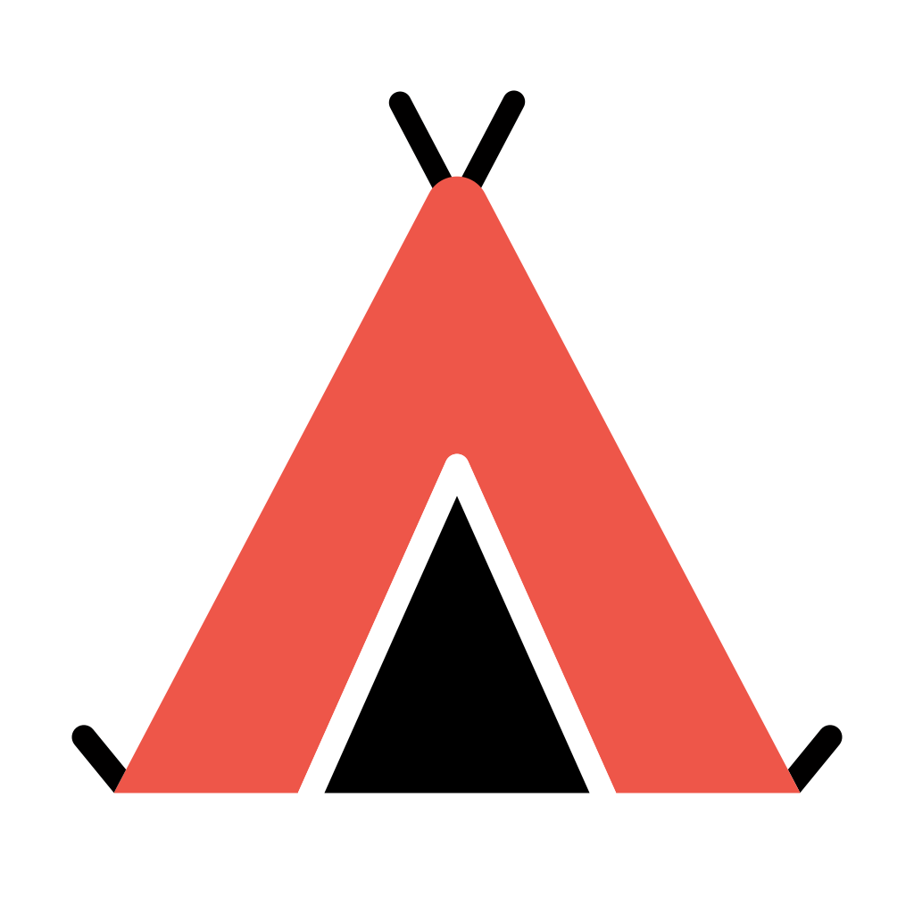

<p align="center">
  
  <br>
  <strong>Build your application core once. Run it where it belongs.</strong>
</p>

<p align="center">
  <a href="https://www.npmjs.com/package/@zeltjs/core"></a>
  <a href="LICENSE"></a>
  
</p>

ZeltJS is a TypeScript application framework with built-in dependency injection. It keeps
controllers, services, and business behavior in a structured application core, then uses a
small adapter entry to run that app on **Node.js**, **Bun**, **Cloudflare Workers**,
**AWS Lambda**, **Electron**, or inside your tests.

<p align="center">
  <a href="https://zeltjs.com">Documentation</a> ·
  <a href="https://stackblitz.com/fork/github/zeltjs/zelt/tree/main/examples/stackblitz-node?startScript=dev&title=ZeltJS%20Quickstart">Try in StackBlitz</a> ·
  <a href="https://zeltjs.com/docs/big-picture">The Big Picture</a>
</p>

> [!CAUTION]
> ZeltJS is pre-alpha. It is ready to explore and shape, but APIs may change between minor
> versions during 0.x.

## Why ZeltJS?

- **Application structure, not only routing** — DI, configuration, lifecycle, validation,
  authentication, logging, background work, and testing share one application model.
- **A clear runtime boundary** — keep deployment-specific startup in small entries and
  replaceable services instead of spreading it through application code.
- **Production-like in-process tests** — `onTest` realizes the same app composition and DI
  lifecycle without opening a network port.
- **Web-standard HTTP** — work with `Request`, `Response`, and Fetch APIs rather than a
  framework-specific HTTP object model.
- **Build-derived contracts** — optional plugins can derive OpenAPI documents, GraphQL
  runtime data, and typed clients from the application definition.

Zelt is a good fit when a router alone leaves your team to reinvent application structure,
or when the same application behavior needs to cross runtime and transport boundaries. For
a tiny runtime-specific handler, a router may be the simpler choice.

## See the boundary in code

Your application describes behavior and dependencies:

```typescript
// app.ts
import { Controller, Get, Injectable, createApp, http, inject } from '@zeltjs/core';

@Injectable()
class GreetingService {
  greet() {
    return 'Hello from ZeltJS!';
  }
}

@Controller('/')
class GreetingController {
  constructor(private greetings = inject(GreetingService)) {}

  @Get('/')
  hello() {
    return { message: this.greetings.greet() };
  }
}

export const app = createApp([http({ controllers: [GreetingController] })]);
```

A small entry chooses where it runs:

```typescript
// node.ts
import { onNode } from '@zeltjs/adapter-node';
import { app } from './app';

const node = await onNode(app);
await node.http.listen(3000);
```

The app definition stays the same for another environment; its entry selects a different
adapter.

## Try it

[](https://stackblitz.com/fork/github/zeltjs/zelt/tree/main/examples/stackblitz-node?startScript=dev&title=ZeltJS%20Quickstart)

Or start locally with Node.js:

```bash
npm install @zeltjs/core @zeltjs/adapter-node
```

Follow the [Node.js Getting Started guide](https://zeltjs.com/docs/getting-started/node) for
the project setup, or read [The Big Picture](https://zeltjs.com/docs/big-picture) before
going deeper.

## Supported Runtimes

| Runtime | Adapter |
| ------- | ------- |
| Node.js | `@zeltjs/adapter-node` |
| Bun | `@zeltjs/adapter-bun` |
| Cloudflare Workers | `@zeltjs/adapter-cloudflare-workers` |
| AWS Lambda | `@zeltjs/adapter-lambda` |
| Electron | `@zeltjs/adapter-electron` |

## Benchmark

The current benchmark snapshot measures both steady-state throughput and startup time.

| Framework | Requests/sec | Cold Start (ms) |
| --------- | -----------: | --------------: |
| Fastify   |       44,033 |             101 |
| **Zelt**  |   **37,331** |          **68** |
| Hono      |       37,262 |              37 |
| AdonisJS  |       33,548 |             149 |
| NestJS    |       23,597 |             268 |

[View full benchmark details →](https://github.com/zeltjs/benchmarks)

## License

MIT
