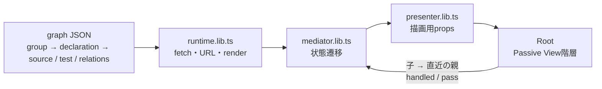

# Studio spatial mock

ec-backend全体を、1宣言1nodeとclass/file/interface groupで表示するReact SPA。
抽出器やCLIへの接続はありません。構造・source・testは手動のJSON fixtureです。

## 起動

リポジトリルートから:

```sh
pnpm install
pnpm --filter @zeltjs/studio-spatial-mock dev
```

http://localhost:4490/ を開きます。以前のPython静的サーバーではなくViteを使います。

```sh
pnpm --filter @zeltjs/studio-spatial-mock build
pnpm --filter @zeltjs/studio-spatial-mock preview
```

`dist/`をそのまま静的ホストへ配置できます。相対baseなのでサブパスにも配置可能。
`ec-backend.snapshot.json`も同じディレクトリに配信してください。バックエンド不要です。

## 構造



- JSONの型と検証: [snapshot.types.ts](src/snapshot.types.ts)、[snapshot-schema.lib.ts](src/snapshot-schema.lib.ts)、[graph.lib.ts](src/graph.lib.ts)。
- 選択・ロック・起点・表示設定はMediatorが判断します。Viewは探索しません。
- 各Viewは親へのイベント出口1本を受け取り、未処理イベントだけを直近の親へ渡します。Context・global busはありません。
- スクロール・ズーム・フォーカスは描画側の責務。GraphViewportがpan/zoomを処理して伝播を止めます。
- URLは`node / root / mode / tab`を保存。nuqsの[loader / serializer](https://nuqs.dev/docs/utilities)を利用し、履歴操作はIO境界に置いています。reload・戻る/進むで復元します。
- fetch・JSON・URLの不正は画面に表示し、代替データで隠しません。

見出し・操作群・行・SVG部品は同ファイルの子Viewに分割しています。Root配下でイベントは親を飛び越えません。
レビュー済み設計は[react-migration-design.md](react-migration-design.md)、検証契約は[implementation-contracts.md](implementation-contracts.md)。

## 表示の意味

閉じた箱は全メンバーを表し、矢印も箱に集約します。同じ向き・種類だけを束ね、×Nは関係の本数です。
閉じた箱と付属middlewareタグは同じ濃淡になります。

近傍は1段。再帰はuseとused byを別々に辿り、途中で方向を反転しません。
ロックは矢印とactive範囲を保持します。詳細の「ここから再帰＋ロック」で起点を固定します。
middleware適用はタグ、event配送はwarp、configは表示切替、app.tsは「アプリ構成」にあります。
列内のgroupはファイルのパス（フォルダを含む）の名前順、同じファイル内はソース出現順で並べます。JSONは座標を持ちません。
宣言の下の注記はpluginが付けたもので、1注記1行です。画面には名前を出し（検索結果の宣言は `Group#宣言名`）、IDはURLにだけ保存します。

下部は「契約 / 実コード」。Unit testは対象宣言に対応する一覧で、分類とmock対象はZeltのDI setupから表示します。
routeを登録したmethodのE2E対応はrequestに基づき、method実行の証明ではありません。
未収録・内部未展開は、testや依存が存在しないという意味ではありません。

## 検証

```sh
pnpm --filter @zeltjs/studio-spatial-mock typecheck
pnpm --filter @zeltjs/studio-spatial-mock lint
pnpm exec biome check mocks/studio-spatial
pnpm --filter @zeltjs/studio-spatial-mock test
pnpm --filter @zeltjs/studio-spatial-mock build
pnpm --filter @zeltjs/studio-spatial-mock exec playwright install chromium
pnpm --filter @zeltjs/studio-spatial-mock test:browser
```

Unit検証はルートの`pnpm test`にも含まれます。buildとtypecheckもworkspaceに接続しています。
ブラウザ検証はbuild後、専用preview（4491）を自動起動し、PC・タブレット・モバイルを検証します。

旧script版の検証はVitest / Playwrightへ置き換えました。
`src/test-fixtures/legacy-display.json`は移行前コードから取得した120状態の表示ハッシュです。
箱の位置・展開・選択・濃淡・タグ・矢印の退行を検出するため、React側の出力から期待値を再生成しないでください。
例外として `expandedY` 廃止時と、列内の並び順をパス順に変えた時に再生成しました。どちらも、y座標以外（展開・選択・濃淡・タグ・矢印・x・幅・高さ）が変更前の出力と一致することを確かめています。
