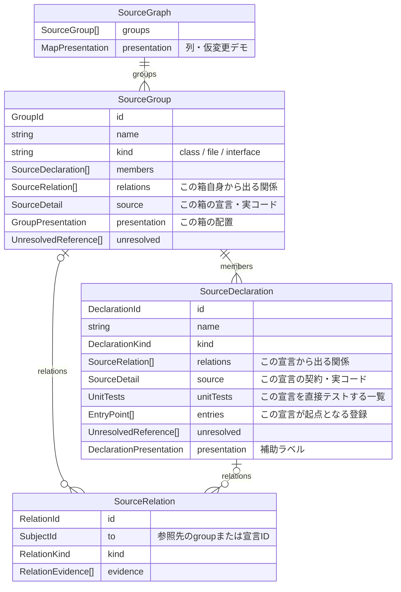
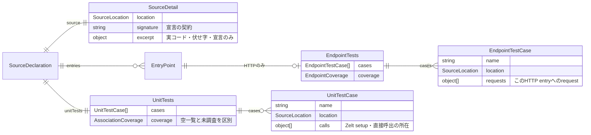
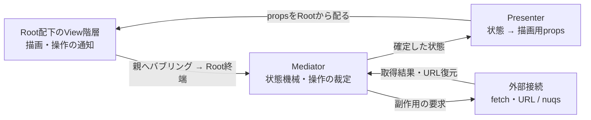
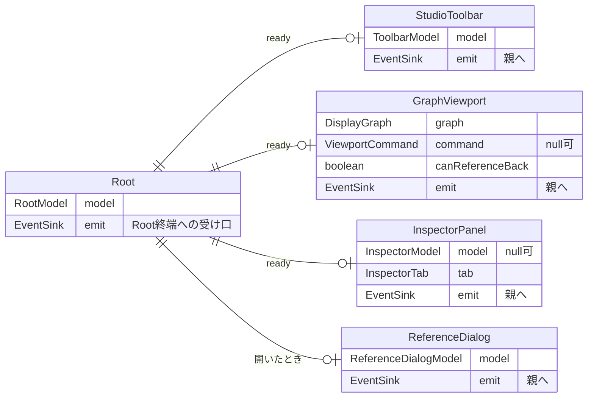
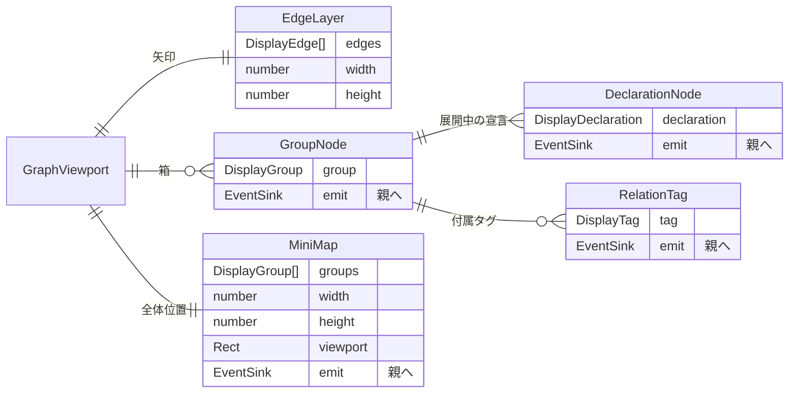
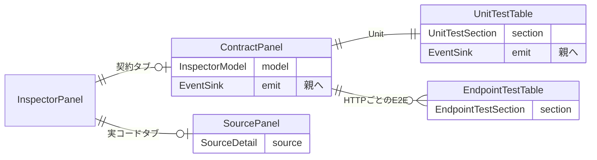

# Studio React移行 — データとcomponent

レビューで合意した設計。React SPAへの移行を実施済み。抽出器への接続は対象外。
実装入口は[README](README.md)、fetch型は[src/snapshot.types.ts](src/snapshot.types.ts)、描画propsは[src/display.types.ts](src/display.types.ts)と[src/presenter.types.ts](src/presenter.types.ts)。

## fetchするデータ

**graphが本体で、sourceやtestはその中の箱・宣言の詳細として持つ。**
`StudioSnapshot` は版・プロジェクト情報と `graph` を包むだけ。source一覧やtest一覧をgraphと並列には置かない。



例えば `OrderService → findById → source / unitTests` と、その宣言の詳細をそのまま辿る。
groupを選んだときのテスト一覧はmembersから集約する。E2Eは宣言の `entries → HTTP entry → e2eTests` に置き、Unitとは分ける。
関係は参照元の `relations` に持つ。各relationの所有者はgroupか宣言のどちらか一つで、`from` はその所有者から決まる。参照先 `to` だけをIDで持ち、同じ宣言を呼出元やflowごとに複製しない。
class自体の `implements / extends` はgroup側、method内のcall等は宣言側に置く。折りたたみ用にmethodの関係をgroupへ重複保存しない。

<details>
<summary>source・testの詳細</summary>



Unitの各直接呼出にZeltのsetupを添える。Solitary/Sociable・mock class一覧はそこから算出し、import先から推測しない。
configを除くサービス依存が全てoverride済み（または依存なし）ならSolitary、実サービスが残ればSociable。setup未解決なら未判定。
一つのtestが複数の宣言・endpointを対象にする場合、その対応先ごとに同じtest IDの情報を載せる。JSONの重複排除より、その対象の詳細を単独で読めることを優先する。

</details>

<details>
<summary>fetchの型（d.ts相当）</summary>

```ts
type GroupId = string;
type DeclarationId = string;
type SubjectId = GroupId | DeclarationId;
type RelationId = string;
type EntryId = string;
type TestId = string;
type SetupId = string;
type ColumnId = string;

interface StudioSnapshot {
  readonly schemaVersion: 1;
  readonly snapshotId: string;
  readonly project: { readonly id: string; readonly name: string };
  readonly provenance: 'manual-fixture' | 'extracted';
  readonly graph: SourceGraph;
}
interface SourceGraph {
  readonly groups: readonly SourceGroup[];
  readonly presentation: MapPresentation;
}
interface SourceGroup {
  readonly id: GroupId;
  readonly name: string;
  readonly kind: 'class' | 'file' | 'interface';
  readonly filePath: string;
  readonly members: readonly SourceDeclaration[];
  readonly relations: readonly SourceRelation[];
  readonly expansion: 'included' | 'boundary';
  readonly source: SourceDetail;
  readonly unresolved: readonly UnresolvedReference[];
  readonly presentation: GroupPresentation;
}
type DeclarationKind =
  | 'method' | 'constructor' | 'function' | 'callback'
  | 'property' | 'getter' | 'signature' | 'type'
  | 'schema' | 'table' | 'value' | 'event-type';
interface SourceDeclaration {
  readonly id: DeclarationId;
  readonly name: string;
  readonly kind: DeclarationKind;
  readonly enclosingDeclarationId: DeclarationId | null;
  readonly relations: readonly SourceRelation[];
  readonly source: SourceDetail;
  readonly unitTests: UnitTests;
  readonly entries: readonly EntryPoint[];
  readonly unresolved: readonly UnresolvedReference[];
  readonly presentation: DeclarationPresentation;
}
type RelationKind =
  | 'call' | 'read' | 'contract' | 'type' | 'schema' | 'table'
  | 'middleware' | 'event' | 'register' | 'extends' | 'implements'
  | 'override' | 'returns' | 'construct';
interface SourceRelation {
  readonly id: RelationId;
  readonly to: SubjectId;
  readonly kind: RelationKind;
  readonly evidence: readonly RelationEvidence[];
}
interface SourceLocation {
  readonly filePath: string;
  readonly startLine: number;
  readonly endLine: number;
}
interface RelationEvidence {
  readonly location: SourceLocation;
  readonly expression: string;
}
interface UnresolvedReference {
  readonly evidence: RelationEvidence;
  readonly reason:
    | 'dynamic-access' | 'external-boundary'
    | 'stored-function-reference' | 'parameter-callback' | 'symbol-unresolved';
}
interface SourceDetail {
  readonly location: SourceLocation;
  readonly signature: string;
  readonly excerpt:
    | { readonly kind: 'code'; readonly text: string }
    | { readonly kind: 'redacted'; readonly text: string }
    | { readonly kind: 'declaration-only' };
}
type EntryPoint = { readonly id: EntryId } & (
  | {
      readonly kind: 'http'; readonly method: string; readonly path: string;
      readonly e2eTests: EndpointTests;
    }
  | { readonly kind: 'event'; readonly eventName: string }
  | { readonly kind: 'middleware' }
  | { readonly kind: 'lifecycle'; readonly hook: string }
);
interface UnitTests {
  readonly cases: readonly UnitTestCase[];
  readonly coverage: AssociationCoverage;
}
interface UnitTestCase extends TestIdentity {
  readonly calls: readonly {
    readonly setup: UnitSetup;
    readonly invocation: SourceLocation;
  }[];
}
interface EndpointTests {
  readonly cases: readonly EndpointTestCase[];
  readonly coverage: EndpointCoverage;
}
interface EndpointTestCase extends TestIdentity {
  readonly requests: readonly {
    readonly location: SourceLocation;
    readonly via: 'direct' | 'helper';
  }[];
}
interface TestIdentity {
  readonly id: TestId;
  readonly name: string;
  readonly suite: readonly string[];
  readonly location: SourceLocation;
}
interface ClassReference {
  readonly filePath: string;
  readonly name: string;
}
interface DependencyBinding {
  readonly provide: ClassReference;
  readonly kind: 'service' | 'config';
}
type UnitSetup = {
  readonly id: SetupId;
  readonly targetClass: ClassReference;
  readonly location: SourceLocation;
} & (
  | {
      readonly resolution: 'resolved';
      readonly dependencies: readonly DependencyBinding[];
      readonly configs: readonly ClassReference[];
      readonly overrides: readonly { readonly provide: ClassReference }[];
    }
  | {
      readonly resolution: 'unresolved';
      readonly reason: 'dynamic-setup' | 'unresolved-provider' | 'not-collected';
    }
);
interface AssociationCoverage {
  readonly status: 'complete-in-scope' | 'partial' | 'uncollected';
  readonly searchScope: readonly string[];
  readonly inspectedFiles: readonly string[];
}
interface EndpointCoverage extends AssociationCoverage {
  readonly includesSharedSetup: boolean;
}
interface GroupPresentation {
  readonly origin: 'manual';
  readonly columnId: ColumnId;
  readonly expandedY: number;
  readonly role: 'regular' | 'config' | 'composition';
  readonly hint: string | null;
}
interface DeclarationPresentation {
  readonly origin: 'manual';
  readonly hint: string | null;
}
interface MapPresentation {
  readonly id: string;
  readonly origin: 'manual';
  readonly columns: readonly {
    readonly id: ColumnId; readonly label: string; readonly width: number;
  }[];
  readonly demoScenarios: readonly {
    readonly id: string; readonly label: string;
    readonly selectId: SubjectId; readonly highlightedIds: readonly SubjectId[];
  }[];
}
```

sourceやtestが属する対象は、JSONの包含関係で決まる。所属先のIDを詳細側に重複保存しない。
グラフ探索・検索用のID索引、`used by` の逆引き、全関係一覧は読込後に各所有者のrelationsから作る。配信JSONには二重保存しない。
配置・補助ラベルは各箱のpresentationに置き、手動指定であることを残す。configの秘密値は配信前に除く。

</details>

これは新しい配信契約案で、[既存CLIのDependencyGraph v3](../../packages/cli/src/studio/graph/graph.types.ts)とは非互換。今回は手動fixtureを使い、抽出側との接続は後で扱う。

## componentとprops

**全componentをRoot配下のPassive Viewにする。** Viewは描画用propsを受け取り、操作の意図を親へ渡す。選択・ロックなどの動作はMediatorが決め、Presenterが次の描画用propsを作る。



Presenter・Mediator・外部接続はReact componentではない。起動処理がこれらを組み立て、Rootを描画する。Root自身も状態の裁定はしない。

箱内がprops、線がcomponentの親子関係。propsは下向き、イベントは同じ階層を上向きに通る。`emit` は直近の親の受け口で、各ViewからMediatorを直接呼ぶ口ではない。



<details>
<summary>地図・詳細の内側とprops</summary>





help表示・loading・errorはRoot内で描く。dialogをPortalで描く場合も、論理上の親はRootのまま。

</details>

**イベントの通り道：** `DeclarationNode → GroupNode → GraphViewport → Root → Mediator`。
各境界のhandlerは、担当する描画操作なら処理して停止し、担当外なら同じイベントを直近の親へ一度だけ渡す（Chain of Responsibility）。
例えばMiniMapのパン要求はGraphViewportが表示座標だけを変えて処理済みにする。node選択は途中で裁定せずRootまで渡す。

DOMのclick伝播とは別の型付きイベント経路とする。子のボタン操作が親の選択操作として二重送信されないよう、DOMイベントから意図への変換は発生元で一度だけ行う。Context・global event bus・兄弟への直接通知は使わない。Rootまで未処理の描画イベントは配線不備として報告し、黙って捨てない。

**状態の持ち主：** Mediatorが選択・範囲・展開・表示設定・検索filter・詳細tab・dialog・参照履歴を持つ。Viewに残してよいのはDOM計測、hover、ズーム・スクロール等の描画パラメータだけ。Viewはsnapshotを探索したり、active・middlewareの濃淡・テスト分類を判定したりしない。

Presenterは同じ状態から地図・詳細・操作欄を投影する。折りたたみ時の箱・矢印・タグは同じ表示単位で揃え、詳細のテスト一覧は地図のactive範囲で間引かない。fetchのrelationの所有者から、描画用の`from`を補う。

<details>
<summary>Mediatorの状態遷移と外部接続</summary>

状態は`loading / ready / error`。操作を受け付けるのは`ready`で、存在しない対象など不正な要求は理由付きで拒否し、状態を部分更新しない。

ready内の範囲状態は「選択に追従」と「ロック」を分ける：

| 現在 | 操作の意図 | 次の状態 |
| --- | --- | --- |
| 追従 | nodeを選択 | 詳細と範囲の基準を同じnodeへ |
| 追従 | ロック | 現在の基準・modeを固定。基準なしなら拒否 |
| ロック | nodeを選択 | 詳細だけ変更。activeなnodeとarrowの範囲は維持 |
| ロック | ロック解除 | 現在の詳細選択を範囲の基準に戻す |
| どちらでも | ここから再帰＋ロック / 起点選択 | 対象選択・再帰mode・対象を基準にしたロックを一つの遷移で確定 |
| どちらでも | mode・表示設定・折りたたみを変更 | 明示された変更だけ反映。ロックの基準は維持 |

再帰は基準からuseをuse方向に、used byをused by方向にそれぞれ辿る。途中で方向を切り替えて無関係な枝まで広げない。ロックは選択による範囲の変更を止めるもので、表示設定やmodeの明示変更を禁止するものではない。

Mediatorの裁定は`状態 × 意図 → 次の状態＋副作用の要求 / 拒否理由`としてDOMなしで検証する。外部接続は要求を実行するだけで、遷移規則を持たない。

fetch結果と初回・戻る/進むによるURL復元もMediatorへ入力する。URLの`node / root / mode / tab`は状態の保存表現であり、nuqsとMediatorに独立した二つの正本を作らない。外部接続でdecodeし、Mediatorがsnapshotとの整合を検証してから状態を確定する。URL由来の復元を再度履歴へ書かない。展開・表示設定もURLに保存するかは未決。

参照移動時のviewportはViewから描画値として通知し、復帰用の履歴はMediatorが所有する。地図への移動要求はPresenterが対象の描画座標へ変換し、Viewはその座標を適用するだけ。非同期取得結果は要求IDを照合して古い要求の結果で状態を上書きしない。

</details>

<details>
<summary>イベントと描画用propsの型（fetch対象ではない）</summary>

```ts
// emitは親境界を指す。Viewは任意のstate patchではなく操作の意図を送る。
type ViewIntent =
  | { readonly type: 'subject.select'; readonly id: SubjectId }
  | { readonly type: 'scope.mode'; readonly mode: ScopeMode }
  | { readonly type: 'scope.lock'; readonly locked: boolean }
  | { readonly type: 'scope.start'; readonly id: SubjectId }
  | { readonly type: 'entry.choose'; readonly id: EntryId }
  | { readonly type: 'group.toggle'; readonly id: GroupId }
  | { readonly type: 'groups.expand'; readonly expanded: boolean }
  | { readonly type: 'options.change'; readonly options: ViewOptions }
  | { readonly type: 'search.change'; readonly query: string }
  | { readonly type: 'entry.filter'; readonly kind: EntryPoint['kind'] | 'all' }
  | { readonly type: 'inspector.tab'; readonly tab: InspectorTab }
  | { readonly type: 'subject.locate'; readonly id: SubjectId }
  | { readonly type: 'tag.activate'; readonly key: string }
  | { readonly type: 'demo.choose'; readonly id: string | null }
  | { readonly type: 'composition.open' }
  | { readonly type: 'dialog.close' }
  | { readonly type: 'help.set'; readonly open: boolean }
  | { readonly type: 'reference.back' }
  | { readonly type: 'view.reset' };
// 描画パラメータは領域内で扱える。閲覧状態の変更権限は持たない。
type ViewEvent =
  | ViewIntent
  | { readonly type: 'viewport.pan'; readonly center: Point }
  | { readonly type: 'viewport.observed'; readonly value: ViewportState };
type EventSink = (event: ViewEvent) => void;
// handledなら停止。passなら共通の中継処理が同じeventを親へ渡す。
type BoundaryHandler = (event: ViewEvent) => 'handled' | 'pass';

interface ToolbarModel {
  readonly projectName: string;
  readonly subjects: readonly SubjectLink[];
  readonly entries: readonly EntryOption[];
  readonly query: string;
  readonly entryKind: EntryPoint['kind'] | 'all';
  readonly node: SubjectId | null;
  readonly mode: ScopeMode;
  readonly locked: boolean;
  readonly canLock: boolean;
  readonly options: ViewOptions;
  readonly demoScenarios: MapPresentation['demoScenarios'];
  readonly demoId: string | null;
}
type RootModel =
  | { readonly phase: 'loading' }
  | { readonly phase: 'error'; readonly message: string }
  | {
      readonly phase: 'ready';
      readonly toolbar: ToolbarModel;
      readonly graph: DisplayGraph;
      readonly inspector: InspectorModel | null;
      readonly tab: InspectorTab;
      readonly dialog: ReferenceDialogModel | null;
      readonly helpOpen: boolean;
      readonly canReferenceBack: boolean;
      readonly viewportCommand: ViewportCommand | null;
      readonly notice: string | null;
    };
type EntryOption = EntryPoint & { readonly targetId: DeclarationId };
interface UnitCoverage extends AssociationCoverage { readonly declarationId: DeclarationId }
type ScopeMode = 'near' | 'flow' | 'all';
type InspectorTab = 'contract' | 'source';
interface ViewOptions {
  readonly showTypes: boolean;
  readonly showCounts: boolean;
  readonly showConfig: boolean;
}
type ScopeState =
  | { readonly kind: 'following'; readonly mode: ScopeMode }
  | { readonly kind: 'locked'; readonly mode: ScopeMode; readonly anchor: SubjectId };
// Mediatorの閲覧状態の抜粋。検索・dialog・履歴等は省略。Viewへ直接渡さない。
interface ViewState {
  readonly node: SubjectId | null;
  readonly scope: ScopeState;
  readonly tab: InspectorTab;
  readonly expanded: readonly GroupId[];
  readonly options: ViewOptions;
}
interface Rect { readonly x: number; readonly y: number; readonly width: number; readonly height: number }
interface Point { readonly x: number; readonly y: number }
interface SubjectLink { readonly id: SubjectId; readonly label: string }
interface VisualState { readonly dimmed: boolean; readonly selected: boolean; readonly changed: boolean }
interface DisplayDeclaration extends VisualState {
  readonly subject: SubjectLink;
  readonly kind: DeclarationKind;
  readonly hint: string | null;
  readonly rect: Rect;
}
interface DisplayTag {
  readonly key: string;
  readonly kind: 'middleware' | 'warp' | 'config';
  readonly label: string;
  readonly dimmed: boolean;
  readonly relationIds: readonly RelationId[];
}
interface DisplayGroup extends VisualState {
  readonly subject: SubjectLink;
  readonly kind: SourceGroup['kind'];
  readonly boundary: boolean;
  readonly expanded: boolean;
  readonly rect: Rect;
  readonly declarations: readonly DisplayDeclaration[];
  readonly tags: readonly DisplayTag[];
}
interface DisplayEdge {
  readonly key: string;
  readonly from: SubjectId;
  readonly to: SubjectId;
  readonly kind: RelationKind;
  readonly relationIds: readonly RelationId[];
  readonly path: string;
  readonly countLabel: { readonly text: string; readonly at: Point } | null;
  readonly title: string;
}
interface DisplayGraph {
  readonly width: number;
  readonly height: number;
  readonly columns: readonly { readonly id: ColumnId; readonly label: string; readonly rect: Rect }[];
  readonly groups: readonly DisplayGroup[];
  readonly edges: readonly DisplayEdge[];
  readonly summary: string;
}
interface UnitTestRow {
  readonly test: TestIdentity;
  readonly target: SubjectLink;
  readonly style: 'Solitary' | 'Sociable' | null;
  readonly mocks: readonly ClassReference[] | null;
}
interface EndpointTestRow {
  readonly test: TestIdentity;
  readonly requests: EndpointTestCase['requests'];
}
interface UnitTestSection {
  readonly rows: readonly UnitTestRow[];
  readonly coverage: readonly UnitCoverage[];
  readonly showTargetColumn: boolean;
}
interface EndpointTestSection {
  readonly entryId: EntryId;
  readonly label: string;
  readonly rows: readonly EndpointTestRow[];
  readonly coverage: EndpointCoverage;
}
interface InspectorModel {
  readonly subject: SubjectLink;
  readonly kind: SourceGroup['kind'] | DeclarationKind;
  readonly source: SourceDetail;
  readonly members: readonly SubjectLink[];
  readonly unit: UnitTestSection;
  readonly endpoints: readonly EndpointTestSection[];
  readonly canUseAsRoot: boolean;
  readonly locationAction: 'locate-map' | 'open-composition';
  readonly unresolved: readonly UnresolvedReference[];
}
interface ViewportState { readonly zoom: number; readonly visibleRect: Rect }
type ViewportCommand =
  | { readonly sequence: number; readonly kind: 'locate'; readonly rect: Rect }
  | { readonly sequence: number; readonly kind: 'restore'; readonly value: ViewportState }
  | { readonly sequence: number; readonly kind: 'reset' };
interface RelationRow {
  readonly id: RelationId;
  readonly from: SubjectLink;
  readonly to: SubjectLink;
  readonly kind: RelationKind;
  readonly evidence: readonly RelationEvidence[];
}
type ReferenceDialogModel =
  | { readonly kind: 'relations'; readonly title: string; readonly rows: readonly RelationRow[] }
  | {
      readonly kind: 'composition'; readonly title: string;
      readonly rows: readonly RelationRow[]; readonly sourceTarget: SubjectLink;
    };
```

</details>

Passive Viewの役割分離は[Fowlerの説明](https://martinfowler.com/eaaDev/PassiveScreen.html)を参照。親方向のイベント経路と状態機械Mediatorの組合せは、今回指定されたStudioの設計。
