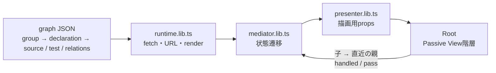

# Studio UI

アプリ全体を、1宣言1nodeとclass/file/interface groupで表示するReact SPA。`zelt studio` が抽出した
snapshotを同じoriginの `snapshot.json` から読みます。開発・検証ではec-backendから生成した
test fixtureを `snapshot.json` として配信します（[vite.config.ts](vite.config.ts)）。

## snapshotの生成

`test-fixtures/ec-backend.snapshot.json`は生成物です。手で編集せず、[ec-backend.extract.json](ec-backend.extract.json)を入力に生成し直してください（出力先はconfigの`output`）。

```sh
pnpm nx run @zeltjs/cli:build
node packages/cli/dist/cli.js studio extract --config packages/studio-ui/ec-backend.extract.json
```

appを読み込む子プロセスのentryはcliのbuild成果物（`dist/studio-extract/zelt-inspect-entry.js`）なので、
buildしたcliから実行します。ルートの`pnpm verify-generated:studio-snapshot`が、この再生成とfixtureの
差分検出をまとめて行います。

同じ入力なら何度生成しても同じJSON（同じ`snapshotId`）になります。生成結果が期待と違うときは、JSONではなくconfigか抽出器を直します。

## 起動

リポジトリルートから:

```sh
pnpm install
pnpm --filter @zeltjs/studio-ui dev
```

http://localhost:4490/ を開きます。devとpreviewは`/snapshot.json`にtest fixtureを返します。

```sh
pnpm --filter @zeltjs/studio-ui build
pnpm --filter @zeltjs/studio-ui preview
```

`dist/`は`snapshot.json`を含みません（`publicDir`無効）。相対baseなのでサブパスにも配置可能で、
配信側が同じディレクトリに`snapshot.json`を返せば動きます（`zelt studio`がこれを行います）。

## 構造



- JSONの型と検証: [@zeltjs/studio-extract/snapshot](../studio-extract/src/core/snapshot-schema.lib.ts)（schemaと型のSoT）、[graph.lib.ts](src/graph.lib.ts)。
- 選択・ロック・起点・表示設定はMediatorが判断します。Viewは探索しません。
- 各Viewは親へのイベント出口1本を受け取り、未処理イベントだけを直近の親へ渡します。Context・global busはありません。
- スクロール・ズーム・フォーカスは描画側の責務。GraphViewportがpan/zoomを処理して伝播を止めます。
- URLは`node / root / mode / tab`を保存。nuqsの[loader / serializer](https://nuqs.dev/docs/utilities)を利用し、履歴操作はIO境界に置いています。reload・戻る/進むで復元します。
- fetch・JSON・URLの不正は画面に表示し、代替データで隠しません。

見出し・操作群・行・SVG部品は同ファイルの子Viewに分割しています。Root配下でイベントは親を飛び越えません。
レビュー済み設計は[react-migration-design.md](react-migration-design.md)、検証契約は[implementation-contracts.md](implementation-contracts.md)。

## 表示の意味

閉じた箱は全メンバーを表し、矢印も箱に集約します。同じ向き・種類だけを束ね、×Nは関係の本数です。
閉じた箱と付属middlewareタグは同じ濃淡になります。

近傍は1段。再帰はuseとused byを別々に辿り、途中で方向を反転しません。
ロックは矢印とactive範囲を保持します。詳細の「ここから再帰＋ロック」で起点を固定します。
middleware適用はタグ、event配送はwarpです。列はすべて（ライブラリ・Config・Compositionを含む）表示/非表示を切り替えられます。非表示の列は、箱もその箱への線もタグも表示しません（列を戻せば戻ります）。app.tsはComposition列にあり、既定で非表示です。
列内のgroupはファイルのパス（フォルダを含む）の名前順、同じファイル内はソース出現順で並べます。展開したgroupの中の宣言もソース出現順です。JSONは座標を持ちません。
ライブラリは右端の「ライブラリ」列にあり、アプリが直接使うメンバーだけを並べます（内部未展開）。configで採用したignore（Zelt pluginの推奨）に入るもの（`inject`・`request`・`LifecycleManager` 等）は地図に出しません。
線と宣言の種類はTSの事実だけで、schema・table・登録などはpluginが付与した意味として表示します。middleware・event・appへの登録はpluginが付与した線です。
inject・middleware指定・設定の差し替え・lifecycle登録はsetupとして詳細の「Setup」に出し、線にはしません。
宣言の下の注記はpluginが付けたもので、1注記1行です。画面には名前を出し（検索結果の宣言は `Group#宣言名`）、IDはURLにだけ保存します。

下部は「契約 / 実コード」。Unit testは、case本文が直接呼んだ宣言に対応する一覧で、分類（Solitary / Sociable / 関数）とmock対象はZeltのDI setup（`createTestTarget`）から表示します。ec-backendの212 caseのうち151 caseが結び付きます（schemaの `safeParse`、本物のapp経由のmiddleware等は結びません）。
routeを登録したmethodのE2E対応はrequestに基づき、method実行の証明ではありません。E2Eの収録範囲は `product.spec.ts` のサンプリングなので、どのrouteも「一部のみ」です（一致しないrouteは0件）。
未収録・内部未展開は、testや依存が存在しないという意味ではありません。

## 検証

```sh
pnpm --filter @zeltjs/studio-ui typecheck
pnpm --filter @zeltjs/studio-ui lint
pnpm exec biome check packages/studio-ui
pnpm --filter @zeltjs/studio-ui test
pnpm --filter @zeltjs/studio-ui build
pnpm --filter @zeltjs/studio-ui exec playwright install chromium
pnpm --filter @zeltjs/studio-ui test:browser
```

Unit検証はルートの`pnpm test`にも含まれます。buildとtypecheckもworkspaceに接続しています。
ブラウザ検証はbuild後、専用preview（4491）を自動起動し、PC・タブレット・モバイルを検証します。

旧script版の検証はVitest / Playwrightへ置き換えました。
`test-fixtures/legacy-display.json`は移行前コードから取得した120状態の表示ハッシュです。
箱の位置・展開・選択・濃淡・タグ・矢印の退行を検出するため、React側の出力から期待値を再生成しないでください。
例外として `expandedY` 廃止時と、列内の並び順をパス順に変えた時に再生成しました。どちらも、y座標以外（展開・選択・濃淡・タグ・矢印・x・幅・高さ）が変更前の出力と一致することを確かめています。
3回目は、fixtureを抽出規則に合わせた時（callbackの宣言化、外部パッケージの箱を外部列へ移しアプリが使うメンバーだけに絞る、展開時のメンバーをソース順に並べる）に再生成しました。消えた宣言・線（とそれだけから作られていた外部の箱の設定タグ）と、足したcallback・線を除けば、選択・展開・タグ・矢印が変更前と一致し、xは各groupの列の位置に移っただけであることを確かめています。濃淡の差は、線の増減で近傍が変わった2か所（`JwtService.sign` を選んだときの `JwtConfig`、`OrderService.findById` から辿ったときの `users`）だけです。
4回目は、fixtureをconfig（[ec-backend.extract.json](ec-backend.extract.json)）と抽出規則で照合して直した時に再生成しました。変わったのは矢印だけで、`OrderHandlers.startup` → 購読callbackの `read` が消え（同じ2点の `register` 1本にまとめた）、`CartService.store` → `KVStore` の `type` が増えた30状態です。箱の位置・展開・選択・濃淡・タグは全状態で変更前と一致することを確かめています。
5回目は、付与だけのモデル（線・宣言の種類をTSの事実と付与された意味に分離）・列の表示切替（roleの廃止、app.tsをComposition列へ）・ignore推奨の採用（`LifecycleManager` を地図から外す）に合わせた時に再生成しました。golden の状態の `showConfig` は Config 列の表示として読み、Composition 列は既定どおり非表示です。変更前後の投影（箱の集合・展開・選択・濃淡・宣言・タグ・矢印・x）を突き合わせ、差は次だけであることを確かめています: appに登録された9箱に「Compositionとの関係あり」タグが付く（その分の高さとyの移動）、`LifecycleManager` への矢印2本と `returns` の矢印1本が消える（それに伴い全関係・展開時の `OrderHandlers.constructor` が薄くなる）、Config列を隠した状態でライブラリのconfig箱（`JwtConfig`・`CorsConfig`）が表示され、ライブラリ列が詰めた分だけ左へ動く。
6回目は、非表示の列のタグ（「<列名>との関係あり」）を廃止し、非表示の列に端を持つ関係を線にもタグにもしないようにした時に再生成しました。変更前のコードを一時的に復元して120状態すべてで保存済みのハッシュが再現することを確かめたうえで、変更前後の投影を突き合わせ、差は「Compositionとの関係あり」タグ（各状態8個）と、Config列を隠した状態の「Configとの関係あり」タグの消滅、それに伴う箱の高さ・yの移動だけであることを確かめています。矢印・x・幅・展開・選択・濃淡・宣言・残るタグは全状態で変更前と一致します（goldenの状態では、相手が非表示の列にあるmiddleware・eventタグは無い）。
7回目は、appが書かずにcoreがrouterごとに先頭で登録する組込みmiddleware（`CorsMiddleware`・`SecureHeadersMiddleware`）を地図に出さないと決めた時（ユーザー判断 2026-09-24）に再生成しました。変更前のfixtureで120状態すべてが保存済みのハッシュを再現することを確かめたうえで、変更前後の投影を突き合わせ、差は「その2箱の消滅（各状態2個）と、4つのcontrollerから消える `適用: Cors`・`適用: SecureHeaders` タグ（各状態8個）、それに伴う箱の高さ（各状態4個）とyの移動（各状態7個）」だけであることを確かめています。矢印・x・幅・展開・選択・濃淡・宣言・残るタグは全状態で変更前と一致します（組込みへの線はタグとしてのみ現れていたため、矢印の増減はありません）。

8回目は、fixtureを`zelt studio extract`の出力へ置き換えた時に再生成しました。goldenの`node`とハッシュは、IDではなく画面と同じ表示名（group名・`Group#宣言名`）で持つようにしています。抽出器のIDは所在と構造を写した文字列で、表示名とは1対1に対応します。置き換え前のfixtureで120状態すべてが保存済みのハッシュを再現することを確かめたうえで、表示名で正規化した投影（箱・展開・選択・濃淡・宣言・タグ・矢印・x・幅・高さ）を突き合わせ、120状態すべてで完全に一致することを確かめています（差はゼロ）。JSON内のgroupの並びには表示の意味が無いため、投影は名前順にそろえてから比べます。
