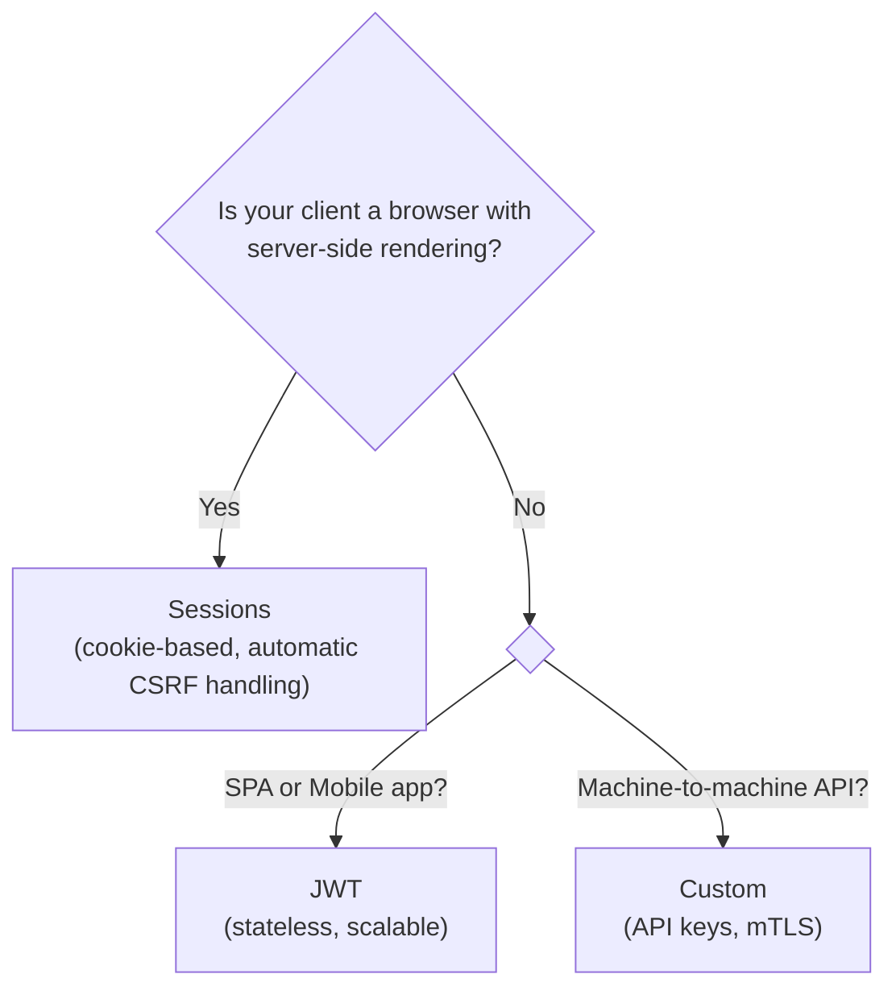
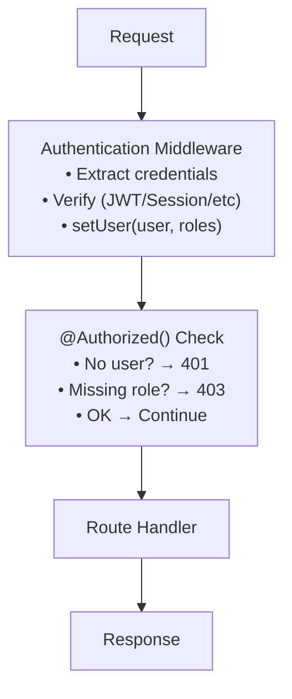

# Overview

Zelt provides a flexible authentication system that separates **authentication** (who is the user?) from **authorization** (what can they do?).

## Authentication vs Authorization

| Concept | Question | Zelt API |
|---------|----------|----------|
| **Authentication** | Who is the user? | `setUser()`, `currentUser()` |
| **Authorization** | What can they do? | `@Authorized()`, `currentRoles()` |

Authentication happens first (typically in middleware), then authorization checks run on protected routes.

## Choose Your Strategy

Zelt supports multiple authentication strategies. Pick the one that fits your architecture:

| Strategy | Best For | Package |
|----------|----------|---------|
| **JWT** | SPAs, Mobile apps, APIs | `@zeltjs/auth-jwt` |
| **Sessions** | Server-rendered apps, Traditional web apps | `@zeltjs/auth-session` |
| **Custom** | API keys, OAuth, or any other method | Built-in primitives |

### Decision Guide



## Authentication Flow



## Quick Start

### 1. Install a package (or use built-in primitives)

```bash
# For JWT authentication
pnpm add @zeltjs/auth-jwt

# For session authentication
pnpm add @zeltjs/auth-session @zeltjs/kv
```

### 2. Register middleware

```typescript
import { createApp, Controller, Get, Authorized, currentUser, http } from '@zeltjs/core';
import { JwtMiddleware, JwtConfig } from '@zeltjs/auth-jwt';

@Controller('/users')
class UserController {
  @Authorized() @Get('/me')
  me() { return currentUser(); }
}
// ---cut---
const app = createApp([http({
    controllers: [UserController],
    middlewares: [JwtMiddleware],
  })], { configs: [JwtConfig] });
```

### 3. Protect routes

```typescript
// @noErrors
// Reason: module augmentation requires full module resolution unavailable in Twoslash VFS
import '@zeltjs/core';
declare module '@zeltjs/core' {
  interface RequestContextSchema {
    user: { name: string };
  }
}
import { Controller, Get, Authorized, currentUser } from '@zeltjs/core';
// ---cut---
@Controller('/dashboard')
class DashboardController {
  @Authorized()
  @Get('/')
  index() {
    const user = currentUser();
    return { message: `Hello, ${user?.name}` };
  }
}
```

## Next Steps

- [User Context](./user-context) — How to type and access the authenticated user
- [JWT Authentication](./jwt) — Stateless token-based authentication
- [Session Authentication](./sessions) — Cookie-based session management
- [Custom Authentication](./custom) — Build your own authentication middleware
