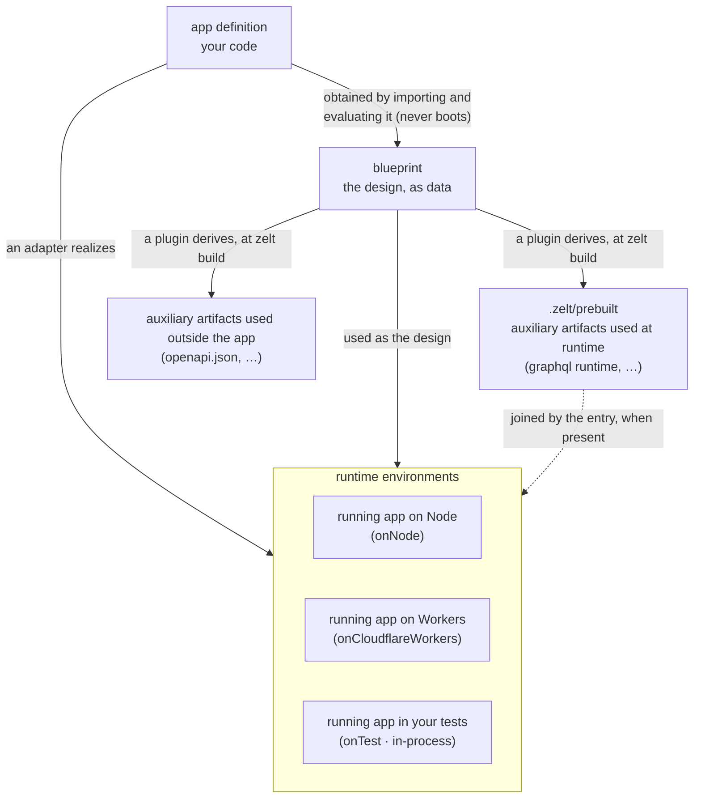
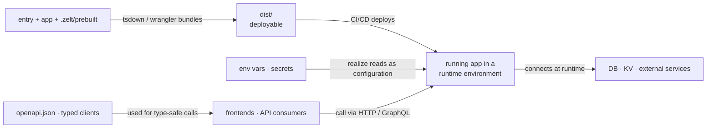

# The Big Picture

With Zelt, what you write is your application's functionality — and only
that. The GraphQL schema, the OpenAPI document, typed clients, and the
startup wiring are all derived from your code. And the same app runs on
Node, Bun, Cloudflare Workers, Lambda — and inside your tests — by swapping
a single adapter call.

The map below shows why that is possible.

## What you write

- **app definition** — `createApp([...])` with your features: HTTP
  controllers, GraphQL resolvers, commands, schedulers, and the services
  behind them. The description of your application's functionality; it
  imports nothing from `.zelt/` and contains no startup logic.
- **entry** — a few lines per platform (`node.ts`, `worker.ts`, …) that
  import the app and the prebuilt and hand both to an adapter. The only
  place your code touches `.zelt/`.
- **tests** — they play the same role as an entry: join app + prebuilt and
  hand them to `onTest`, which is one adapter among the others. Tests are
  not a parallel world; they go through the same path as production,
  in-process.
- **zelt.config.ts** — your instructions to the CLI: which plugins to run,
  build and dev settings.

## zelt CLI (build / dev)

`zelt build` (and every `zelt dev` restart) imports your app definition and
evaluates it. Evaluation collects decorators and type metadata but boots
nothing — no server, no connections. The result is the **blueprint**: your
app's routes, resolvers, and types as plain data.

Plugins consume the blueprint and derive artifacts: the GraphQL schema and
executable runtime, the OpenAPI document, typed clients. One source, many
derivatives — none can drift from the code, and removing something from the
app removes its artifacts on the next build.
And plugins are strictly optional — your app runs with none of them.

Finally the bundle step (tsdown on Node, wrangler on Workers) packs the
entry and everything it imports into `dist/`.

## generated

- **`.zelt/`** — artifacts derived from *the app itself*. They flow *out
  of* your app: only entries and tests import them (the app cannot depend
  on its own derivatives). Disposable and reproducible — delete the
  directory and `zelt build` recreates it. The runtime pieces are bundled
  into one value module, `.zelt/prebuilt.ts`.
- **`openapi.json` / typed clients** — derivatives for the world outside
  your app: frontends and API consumers. Because they are derived from the
  code, the spec cannot disagree with the implementation.
- **`dist/`** — the deployable: entry + app + prebuilt packed together, the
  unit you ship to a runtime environment.

## Runtime environments

Adapters are interchangeable implementations of the same job: take your
app’s code, its blueprint, and — when present — `.zelt/prebuilt`, and
**realize** them — run DI, read configuration from the
environment, open connections to databases and external services, start
servers. `onNode`, `onBun`, `onCloudflareWorkers`, `onLambda`,
`onElectron` — and `onTest`. Switching platforms means swapping this one
call; the rest of the map is untouched.

Seen from deployment and operations, the map connects like this:

At startup each feature checks its prebuilt entry against the code and
fails loudly with the fix (`zelt build`) if they have drifted — stale
artifacts never run silently.
