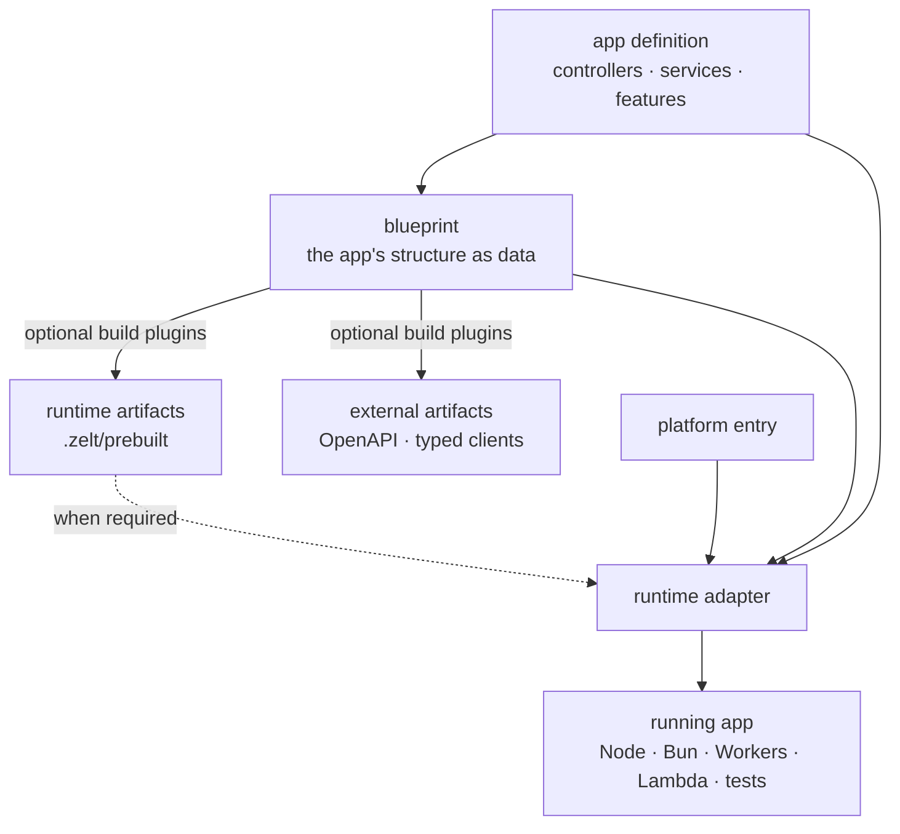
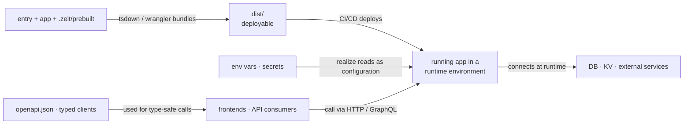

# The Big Picture

Zelt keeps the **application core** separate from the environment that runs it.
Controllers, services, and features live in an app definition. Small, platform-specific
entry files hand that same app to a Node.js, Bun, Workers, Lambda, Electron, or test
adapter.

This is the boundary Zelt makes portable. Platform entries and infrastructure settings
still differ; your application behavior does not have to.

## The 30-second model



In concrete files, a small Node.js project looks like this:

```text
src/
├── app.ts          # portable application core
└── node.ts         # Node-specific entry
zelt.config.ts      # build and plugin configuration, when needed
.zelt/
└── prebuilt.ts     # generated runtime artifacts, when needed
dist/               # bundled deployable
```

## 1. App definition: behavior you own

`createApp([...])` composes the features of your application: HTTP controllers,
GraphQL resolvers, commands, schedulers, and the services behind them.

```typescript
import { Controller, createApp, http } from '@zeltjs/core';
@Controller('/')
class GreetingController {}

// app.ts

export const app = createApp([
  http({ controllers: [GreetingController] }),
]);
```

The app definition should not import from `.zelt/`, start a server, or open connections
at module scope. Keeping those effects out is what lets the CLI inspect the app and lets
different adapters realize it safely.

## 2. Blueprint: the app's structure as data

Importing and evaluating the app definition collects its feature and decorator metadata.
Zelt represents the result as a **blueprint**: routes, resolvers, types, and other
structural information expressed as data.

Both build tools and runtime adapters use this design. Evaluation alone does not ask an
adapter to start servers or connect to infrastructure; application modules should follow
the same side-effect-free boundary.

## 3. Build artifacts: derived when a feature needs them

`zelt build` (and every `zelt dev` restart) imports your app definition and
evaluates it, then optional plugins consume the blueprint. They can derive:

- **`.zelt/prebuilt.ts`** — runtime data required by features such as GraphQL;
- **OpenAPI documents and typed clients** — contracts used outside the app; and
- other plugin-specific artifacts.

These files flow out of the app definition. Entries and tests may import
`.zelt/prebuilt`; the app definition must not depend on its own generated output. The
directory is disposable and `zelt build` can recreate it.

Today Zelt checks structural consistency, such as endpoint paths or resolver sets, at
build or startup. It does not yet prove that every implementation detail and method
signature agrees with every generated artifact. Rebuild after changing the app; stale
structural artifacts fail with a message directing you to `zelt build`.

Finally, a bundler such as tsdown or Wrangler packages the entry and everything it
imports into `dist/`.

## 4. Runtime adapter: where effects begin

An entry selects the environment and hands it the app:

```typescript
// node.ts
import { onNode } from '@zeltjs/adapter-node';
import { createApp, http } from '@zeltjs/core';
const app = createApp([http({ controllers: [] })]);
// ---cut---
// app is imported from ./app

const node = await onNode(app);
await node.http.listen(3000);
```

The adapter **realizes** the design: it creates the DI runtime, reads environment
configuration, runs lifecycle hooks, and exposes platform capabilities. Services can
then open database or external-service connections as part of that lifecycle.

`onNode`, `onBun`, `onCloudflareWorkers`, `onLambda`, `onElectron`, and `onTest` all
perform this role for different environments. The small entry changes; the app definition
can stay the same.

## What portability includes

| Portable application core | Platform-specific edge |
| --- | --- |
| Controllers and services | Entry file and adapter call |
| DI relationships | Environment variables and secrets |
| Validation and business rules | Deployment and bundler configuration |
| Transport-independent features | Runtime APIs used by infrastructure services |

Runtime-specific code is sometimes necessary. Put it behind an injected service or in
the platform entry rather than assuming every API exists in every environment.

## Tests use the same boundary

Tests act like another entry. They hand the app and any required prebuilt data to
`onTest`, then call it in-process. That exercises the same application composition and DI
lifecycle as production without opening a network port.

## From source to a running deployment

Seen from deployment and operations, the map connects like this:



Next, [follow Getting Started](./getting-started) to run an app, or see the
[Node.js guide](./getting-started/node) for a concrete project setup.
