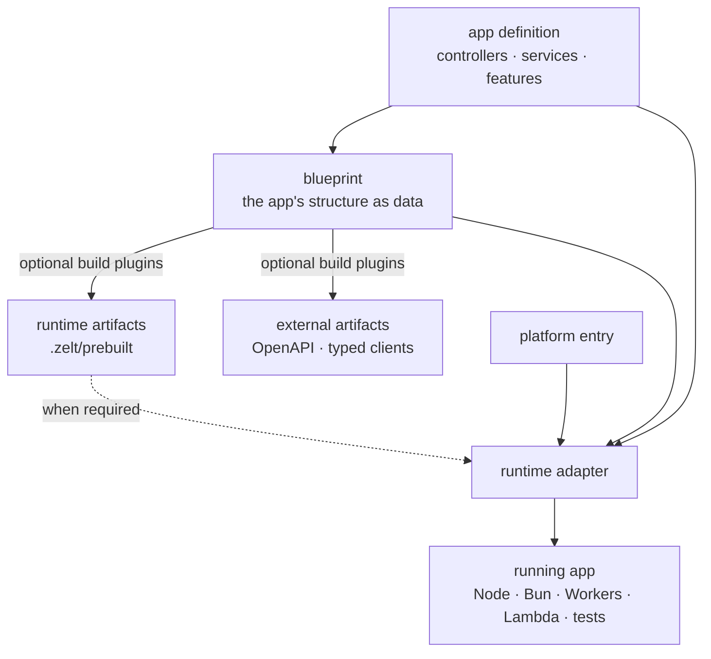

# Architecture

ZeltJS separates the application definition from runtime startup. The definition contains
controllers, services, and features. An entry file passes it to the adapter for Node.js,
Bun, Cloudflare Workers, AWS Lambda, Electron, or tests.

Runtime-specific code remains in the entry file and infrastructure services. The rest of
this page explains that separation and the files produced during a build.

## Components



In concrete files, a small Node.js project looks like this:

```text
src/
├── app.ts          # application definition
└── node.ts         # Node-specific entry
zelt.config.ts      # build and plugin configuration, when needed
.zelt/
└── prebuilt.ts     # generated runtime artifacts, when needed
dist/               # bundled deployable
```

## 1. Application definition

`createApp([...])` composes the features of your application: HTTP controllers,
GraphQL resolvers, commands, schedulers, and the services behind them.

```typescript
import { Controller, createApp, http } from '@zeltjs/core';
@Controller('/')
class GreetingController {}

// app.ts

export const app = createApp([
  http({ controllers: [GreetingController] }),
]);
```

The application definition must not import from `.zelt/`, start a server, or open
connections at module scope. The CLI imports this file during builds, and runtime adapters
import it during startup.

## 2. Blueprint

Importing and evaluating the app definition collects its feature and decorator metadata.
Zelt represents the result as a **blueprint**: routes, resolvers, types, and other
structural information expressed as data.

Build tools and runtime adapters both use the blueprint. Evaluating the application
definition does not start a server or connect to infrastructure, so application modules
must not perform those operations at module scope.

## 3. Generated files

`zelt build` and each `zelt dev` restart import and evaluate the application definition.
Optional plugins then use the blueprint to generate:

- **`.zelt/prebuilt.ts`** — runtime data required by features such as GraphQL;
- **OpenAPI documents and typed clients** — contracts used outside the app; and
- other plugin-specific artifacts.

Entries and tests may import `.zelt/prebuilt`; the application definition must not import
its generated output. `zelt build` can recreate the `.zelt/` directory.

Today Zelt checks structural consistency, such as endpoint paths or resolver sets, at
build or startup. It does not yet prove that every implementation detail and method
signature agrees with every generated artifact. Rebuild after changing the app; stale
structural artifacts fail with a message directing you to `zelt build`.

A bundler such as tsdown or Wrangler then packages the entry and its imports into `dist/`.

## 4. Runtime adapter

An entry selects the environment and hands it the app:

```typescript
// node.ts
import { onNode } from '@zeltjs/adapter-node';
import { createApp, http } from '@zeltjs/core';
const app = createApp([http({ controllers: [] })]);
// ---cut---
// app is imported from ./app

const node = await onNode(app);
await node.http.listen(3000);
```

The adapter creates the DI runtime, reads environment configuration, runs lifecycle hooks,
and exposes platform capabilities. Services can open database or external-service
connections from lifecycle hooks.

`onNode`, `onBun`, `onCloudflareWorkers`, `onLambda`, `onElectron`, and `onTest` all
perform this role for different environments. Each environment has its own entry file and
can use the same application definition.

## Runtime-independent and runtime-specific code

| Runtime-independent code | Runtime-specific code |
| --- | --- |
| Controllers and services | Entry file and adapter call |
| DI relationships | Environment variables and secrets |
| Validation and business rules | Deployment and bundler configuration |
| Transport-independent features | Runtime APIs used by infrastructure services |

Runtime-specific code is sometimes necessary. Put it behind an injected service or in
the platform entry rather than assuming every API exists in every environment.

## Test adapter

Tests pass the application and any required prebuilt data to `onTest`, then call it
in-process. This runs the application composition and DI lifecycle without opening a
network port.

## Build and deployment

The following diagram shows the files and services involved in a deployment:


See [Getting Started](./getting-started) to run an application or the
[Node.js guide](./getting-started/node) for a complete project setup.
