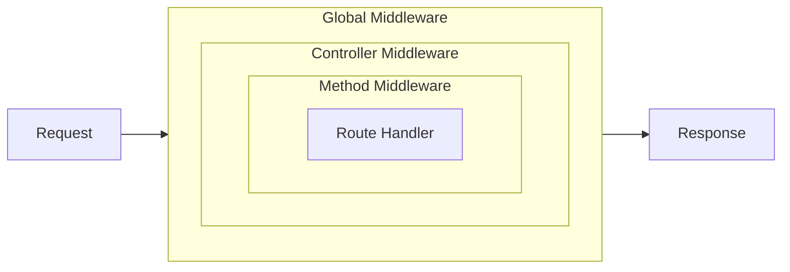

---
---

# Middleware

Middleware classes execute before the route handler and can modify requests, responses, or context.

## Class Middleware

The simplest form of middleware is a class with a `use()` method. Use `request()` and `response()` to access HTTP primitives:

```typescript
import { Middleware, request, type Next } from '@zeltjs/core';

@Middleware
export class LoggingMiddleware {
  async use(next: Next, req = request()): Promise<Response | undefined> {
    const start = Date.now();
    await next();
    const duration = Date.now() - start;
    console.log(`[${req.method()}] ${req.path()} ${duration}ms`);
    return undefined;
  }
}
```

## Middleware Levels

Zelt supports middleware at three levels, executed in order: **global → controller → method**.

### Global Middleware

Apply to all routes via `createApp()`:

```typescript
import { createApp, Controller, Get, Middleware, request, type Next, http } from '@zeltjs/core';

@Middleware
class LoggingMiddleware {
  async use(next: Next, req = request()) {
    const start = Date.now();
    await next();
    console.log(`[${req.method()}] ${req.path()} ${Date.now() - start}ms`);
    return undefined;
  }
}
@Controller('/users') class UserController { @Get('/') findAll() { return []; } }
// ---cut---
export const app = createApp([http({
    controllers: [UserController],
    middlewares: [LoggingMiddleware],
  })]);
```

### Controller Middleware

Apply to all methods in a controller with `@UseMiddleware`:

```typescript
import { Controller, Get, Middleware, UseMiddleware, type Next } from '@zeltjs/core';

@Middleware
class AuthMiddleware { async use(next: Next) { await next(); return undefined; } }
// ---cut---
@UseMiddleware(AuthMiddleware)
@Controller('/admin')
export class AdminController {
  @Get('/dashboard')
  dashboard() {
    return { stats: [] };
  }
}
```

### Method Middleware

Apply to specific methods:

```typescript
import { Controller, Delete, Get, Middleware, UseMiddleware, request, type Next } from '@zeltjs/core';

@Middleware
class AdminOnlyMiddleware { async use(next: Next) { await next(); return undefined; } }
// ---cut---
@Controller('/posts')
export class PostController {
  @Get('/')
  findAll() {
    return { posts: [] };
  }

  @UseMiddleware(AdminOnlyMiddleware)
  @Delete('/:id')
  remove(req = request()) {
    const id = req.pathParam('id');
    return { deleted: id };
  }
}
```

## Skipping Middleware

Use `@SkipMiddleware` to exclude specific middleware from a method:

```typescript
import { Controller, Get, Middleware, SkipMiddleware, type Next } from '@zeltjs/core';

@Middleware
class AuthMiddleware { async use(next: Next) { await next(); return undefined; } }
// ---cut---
@Controller('/api')
export class ApiController {
  @Get('/protected')
  protected() {
    return { secret: 'data' };
  }

  @SkipMiddleware(AuthMiddleware)
  @Get('/health')
  health() {
    return { status: 'ok' };
  }
}
```

Apply `@SkipMiddleware` to a controller class to exclude middleware from every route in that controller:

```typescript
import { Controller, Get, Middleware, SkipMiddleware, type Next } from '@zeltjs/core';

@Middleware
class AuthMiddleware { async use(next: Next) { await next(); return undefined; } }
// ---cut---
@SkipMiddleware(AuthMiddleware)
@Controller('/public')
export class PublicController {
  @Get('/health')
  health() {
    return { status: 'ok' };
  }

  @Get('/version')
  version() {
    return { version: '1.0.0' };
  }
}
```

Class-level and method-level skip declarations are combined. If a controller skips `AuthMiddleware` and a method skips `LoggingMiddleware`, that method skips both.

More specific middleware attachment wins over a class-level skip. If a controller has `@SkipMiddleware(AuthMiddleware)` but one method also has `@UseMiddleware(AuthMiddleware)`, `AuthMiddleware` runs for that method. If the same method has both `@UseMiddleware(AuthMiddleware)` and `@SkipMiddleware(AuthMiddleware)`, the method-level skip wins.

`CorsMiddleware` and `SecureHeadersMiddleware` are auto-registered on every HTTP app. See [HTTP Security](./http-security.md) for their defaults, configuration options, skip examples, and CORS preflight behavior.

## Middleware Results

Middleware can provide a typed value to the code that runs after it. Providing a value uses the `Next<T>` type together with `next(value)`; reading it uses `resultOf(M)`. There are no string keys or module augmentation to maintain.

### Providing a Value

A middleware that provides a value declares it in `Next<T>` and passes it to `next(value)`:

```typescript
import { Middleware, request, type Next } from '@zeltjs/core';

declare function verifyToken(token: string): Promise<{ id: number; name: string } | null>;
// ---cut---
@Middleware
export class AuthMiddleware {
  async use(next: Next<{ id: number; name: string }>, req = request()): Promise<Response | undefined> {
    const token = req.header('Authorization');
    const user = token ? await verifyToken(token) : null;
    if (!user) return Response.json({ error: 'Unauthorized' }, { status: 401 });
    await next(user);
    return undefined;
  }
}
```

Because `Next<T>` requires an argument, calling `next()` without a value is a type error. Middleware that provides nothing keeps using the plain `Next` type, as in the examples above.

### Reading a Value

Handlers — and other middleware — read a provided value with `resultOf(M)`, passed as a parameter default:

```typescript
import { Controller, Get, Middleware, UseMiddleware, request, resultOf, type Next } from '@zeltjs/core';

@Middleware
class AuthMiddleware {
  async use(next: Next<{ id: number; name: string }>, req = request()): Promise<Response | undefined> {
    await next({ id: 1, name: 'placeholder' });
    return undefined;
  }
}
// ---cut---
@UseMiddleware(AuthMiddleware)
@Controller('/profile')
export class ProfileController {
  @Get('/')
  getProfile(user = resultOf(AuthMiddleware)) {
    return { id: user.id, name: user.name };
  }
}
```

The type reflects `M`'s own `Next<T>` declaration as-is — a middleware declared as `Next<string | undefined>` yields a nullable result. In this example, `AuthMiddleware` short-circuits with a 401 response before it ever calls `next(user)`, so by the time a handler runs, the value is guaranteed to exist. Middleware reads another middleware's value the same way, as a parameter default on its own `use()` method.

### Reading Requires the Middleware

Calling `resultOf(M)` throws immediately, with an error naming the middleware, in two cases: the middleware isn't applied to the route, or it is applied but never called `next(value)` (so no value was ever recorded). There is no silent `undefined`. Applying middleware to a route still works exactly as before, with `@UseMiddleware` on a controller or method, or with `middlewares` on a module.

## Dependency Injection

For middleware that requires dependency injection, use `@Middleware`:

```typescript
import { Config, Env, Middleware, inject, request } from '@zeltjs/core';
import type { Next } from '@zeltjs/core';

@Config
class AuthConfig {
  static readonly Token = AuthConfig;

  constructor(private env = inject(Env)) {}

  get secret() {
    return this.env.getString('AUTH_SECRET');
  }
}

@Middleware
export class AuthMiddleware {
  constructor(private config = inject(AuthConfig)) {}

  async use(next: Next, req = request()): Promise<Response | undefined> {
    const secret = this.config.secret;
    // ... authentication logic
    await next();
    return undefined;
  }
}
```

Use class middleware the same way as function middleware:

```typescript
import { Controller, UseMiddleware, Middleware, Get, type Next } from '@zeltjs/core';

@Middleware class AuthMiddleware { async use(next: Next) { await next(); return undefined; } }
// ---cut---
@UseMiddleware(AuthMiddleware)
@Controller('/admin')
export class AdminController {
  @Get('/') index() { return { ok: true }; }
}
```

## Middleware with Options

Middleware that requires configuration extends `MiddlewareWithOptions<TOptions>` and reads its options with `optionsOf()`, as a parameter default — the same pattern as `request()` and `resultOf()`:

```typescript
import { Middleware, MiddlewareWithOptions, optionsOf, type Next } from '@zeltjs/core';
// ---cut---
interface RateLimitOptions {
  limit: number;
  windowSec: number;
}

@Middleware
export class RateLimitMiddleware extends MiddlewareWithOptions<RateLimitOptions> {
  async use(next: Next, opts = optionsOf(RateLimitMiddleware)) {
    const { limit, windowSec } = opts;
    // ... rate limiting logic
    await next();
    return undefined;
  }
}
```

Pass the options where the middleware is applied, with `.with()`:

```typescript
import { Controller, Middleware, MiddlewareWithOptions, Post, UseMiddleware, optionsOf, type Next } from '@zeltjs/core';

interface RateLimitOptions {
  limit: number;
  windowSec: number;
}

@Middleware
class RateLimitMiddleware extends MiddlewareWithOptions<RateLimitOptions> {
  async use(next: Next, opts = optionsOf(RateLimitMiddleware)) {
    await next();
    return undefined;
  }
}
// ---cut---
@Controller('/api')
export class ApiController {
  @UseMiddleware(RateLimitMiddleware.with({ limit: 10, windowSec: 60 }))
  @Post('/submit')
  submit() {
    return { submitted: true };
  }
}
```

Middleware that takes options is always registered through `.with()`. Registering the bare class is a type error — there would be no options for it to run with.

Middleware without options doesn't extend anything and is registered as the plain class, exactly as in the earlier examples.

### Reading Results from Middleware with Options

To read the result of middleware that takes options, store the return value of `.with()` in a `const` and use that same `const` in both places — where the middleware is applied, and in `resultOf()`:

```typescript
import { Controller, Get, Middleware, MiddlewareWithOptions, UseMiddleware, optionsOf, resultOf, type Next } from '@zeltjs/core';

interface AuthOptions {
  role: 'admin' | 'member';
}

@Middleware
class UserAuthMiddleware extends MiddlewareWithOptions<AuthOptions> {
  async use(next: Next<{ id: number; role: string }>, opts = optionsOf(UserAuthMiddleware)) {
    await next({ id: 1, role: opts.role });
    return undefined;
  }
}
// ---cut---
// user-auth.middleware.ts
export const adminAuth = UserAuthMiddleware.with({ role: 'admin' });

// admin.controller.ts
@UseMiddleware(adminAuth)
@Controller('/admin')
export class AdminController {
  @Get('/me')
  me(admin = resultOf(adminAuth)) {
    return { id: admin.id, role: admin.role };
  }
}
```

Each `.with()` call counts as its own middleware. If a route is registered with one `.with()` call and `resultOf()` receives another — even with identical options — the two don't match: `resultOf()` sees a middleware that isn't applied to the route and throws. Always share a single `const`.

The same middleware class can be applied multiple times with different options. Each application runs independently, and each `const` reads its own result.

## Request Flow



Middleware can process both before and after the route handler by placing logic before or after `await next()`.

## Execution Order

Middleware executes in this order:

1. **Global middleware** (in array order)
2. **Controller middleware** (in decorator order)
3. **Method middleware** (in decorator order)
4. **Route handler**
5. **Post-handler middleware** (reverse order after `next()`)

```typescript
import { Middleware, type Next } from '@zeltjs/core';
// ---cut---
@Middleware
class GlobalMiddleware {
  async use(next: Next) {
    console.log('1. global before');
    await next();
    console.log('6. global after');
  }
}

@Middleware
class ControllerMiddleware {
  async use(next: Next) {
    console.log('2. controller before');
    await next();
    console.log('5. controller after');
  }
}

@Middleware
class MethodMiddleware {
  async use(next: Next) {
    console.log('3. method before');
    await next();
    console.log('4. method after');
  }
}
```

## Common Patterns

Middleware is written as classes. Use `request()`, `response()`, and `resultOf()` for framework primitives.

### Restrict Access

Use class middleware when you need to inject services:

```typescript
import { Middleware, Injectable, inject, currentUser, type Next } from '@zeltjs/core';

@Injectable() class AuthService { isAdmin(user: unknown) { return false; } }
// ---cut---
@Middleware
export class RequireAdmin {
  constructor(private authService = inject(AuthService)) {}

  async use(next: Next): Promise<Response | undefined> {
    const user = currentUser();
    if (!this.authService.isAdmin(user)) {
      return Response.json({ error: 'Forbidden' }, { status: 403 });
    }
    await next();
    return undefined;
  }
}
```

### Add Response Headers

Use `response()` for response headers:

```typescript
import { Middleware, response, type Next } from '@zeltjs/core';
// ---cut---
@Middleware
class PoweredByMiddleware {
  async use(next: Next, res = response()) {
    res.header('X-Powered-By', 'zelt');
    await next();
  }
}
```

Use `{ type: 'append' }` when multiple values for the same header should be preserved:

```typescript
import { Middleware, response, type Next } from '@zeltjs/core';
// ---cut---
@Middleware
class CacheTagMiddleware {
  async use(next: Next, res = response()) {
    res.header('Cache-Tag', 'api');
    res.header('Cache-Tag', 'users', { type: 'append' });
    await next();
  }
}
```

### Measure Response Time

```typescript
import { Middleware, response, type Next } from '@zeltjs/core';
// ---cut---
@Middleware
class TimingMiddleware {
  async use(next: Next, res = response()) {
    const start = Date.now();
    await next();
    res.header('X-Response-Time', `${Date.now() - start}ms`);
  }
}
```
