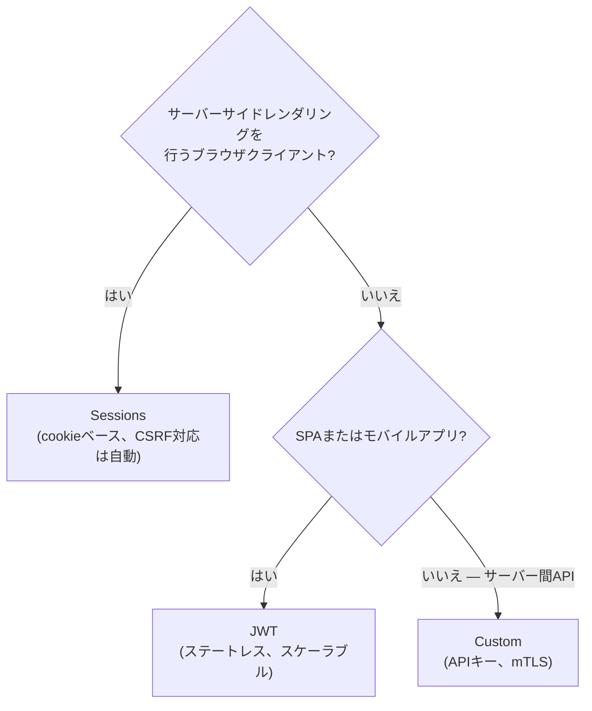
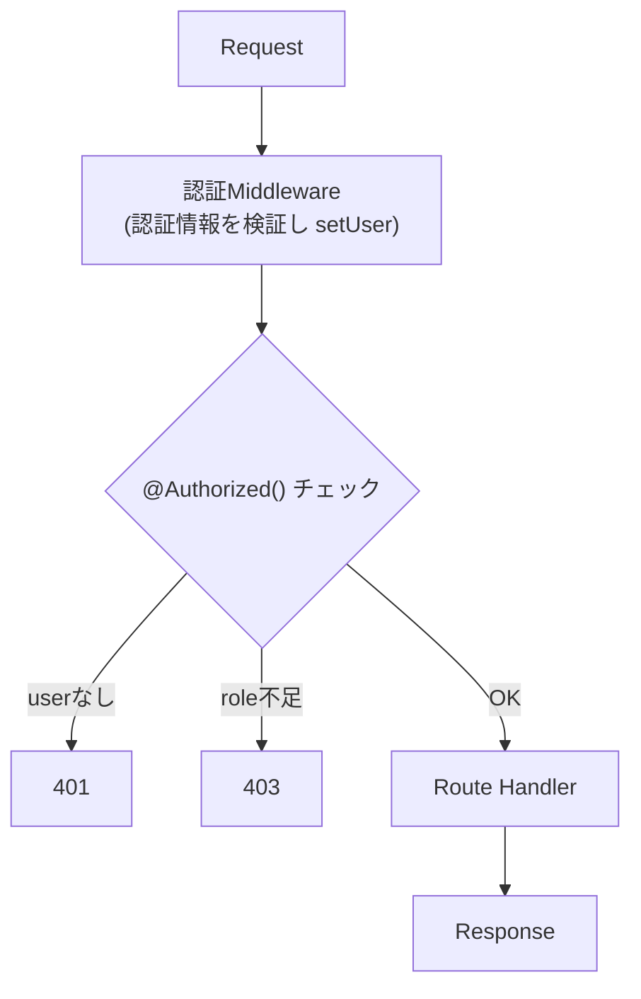

# 概要

Zeltは**authentication**(ユーザーは誰か?)と**authorization**(そのユーザーは何ができるか?)を分離した、柔軟な認証システムを提供します。

## authenticationとauthorizationの違い {#authentication-vs-authorization}

| 概念 | 問い | Zelt API |
|---------|----------|----------|
| **Authentication** | ユーザーは誰か? | `setUser()`, `currentUser()` |
| **Authorization** | 何ができるか? | `@Authorized()`, `currentRoles()` |

authenticationが先に行われ(通常はmiddlewareで)、その後、保護されたルートでauthorizationのチェックが実行されます。

## 戦略を選ぶ {#choose-your-strategy}

Zeltは複数の認証戦略をサポートしています。あなたのアーキテクチャに合うものを選んでください。

| 戦略 | 向いている用途 | パッケージ |
|----------|----------|---------|
| **JWT** | SPA、モバイルアプリ、API | `@zeltjs/auth-jwt` |
| **Sessions** | サーバーレンダリングアプリ、伝統的なWebアプリ | `@zeltjs/auth-session` |
| **Custom** | APIキー、OAuth、その他の方式 | 組み込みprimitive |

### 選択の指針 {#decision-guide}



## 認証の流れ {#authentication-flow}



## クイックスタート {#quick-start}

### 1. パッケージをインストールする(または組み込みprimitiveを使う) {#1-install-a-package-or-use-built-in-primitives}

```bash
# JWT認証の場合
pnpm add @zeltjs/auth-jwt

# セッション認証の場合
pnpm add @zeltjs/auth-session @zeltjs/kv
```

### 2. middlewareを登録する {#2-register-middleware}

```typescript
import { createApp, Controller, Get, Authorized, currentUser, http } from '@zeltjs/core';
import { JwtMiddleware, JwtConfig } from '@zeltjs/auth-jwt';

@Controller('/users')
class UserController {
  @Authorized() @Get('/me')
  me() { return currentUser(); }
}
// ---cut---
const app = createApp([http({
    controllers: [UserController],
    middlewares: [JwtMiddleware],
  })], { configs: [JwtConfig] });
```

### 3. ルートを保護する {#3-protect-routes}

```typescript
// @noErrors
// 理由: module augmentationには完全なモジュール解決が必要だが、Twoslash VFSでは利用できないため
import '@zeltjs/core';
declare module '@zeltjs/core' {
  interface RequestContextSchema {
    user: { name: string };
  }
}
import { Controller, Get, Authorized, currentUser } from '@zeltjs/core';
// ---cut---
@Controller('/dashboard')
class DashboardController {
  @Authorized()
  @Get('/')
  index() {
    const user = currentUser();
    return { message: `Hello, ${user?.name}` };
  }
}
```

## 次のステップ {#next-steps}

- [User Context](./user-context) — 認証済みユーザーの型付けとアクセス方法
- [JWT Authentication](./jwt) — ステートレスなトークンベース認証
- [Session Authentication](./sessions) — cookieベースのセッション管理
- [Custom Authentication](./custom) — 独自の認証middlewareを構築する
