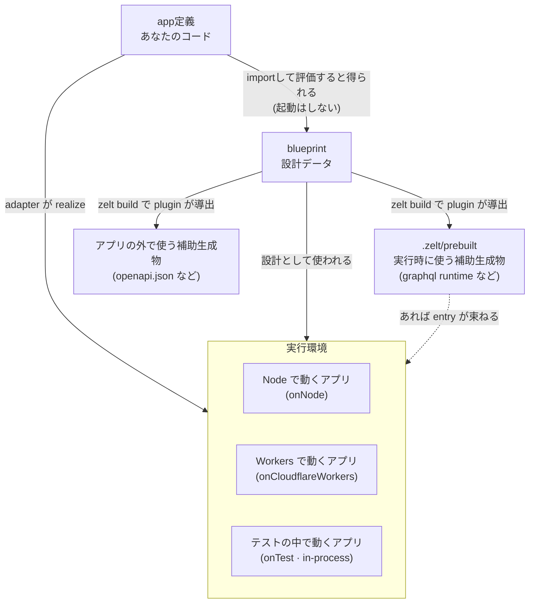
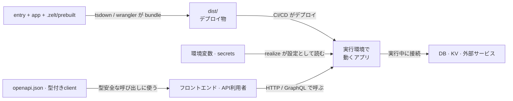

# 全体像

Zeltであなたが書くのは、アプリの機能だけです。GraphQLスキーマも、OpenAPI
ドキュメントも、型付きクライアントも、起動の配線も、すべてコードから導かれます。
そして同じアプリが、Node・Bun・Cloudflare Workers・Lambda — そしてテストの中
まで — adapterひとつの差し替えでそのまま動きます。

それがなぜ可能なのかを示すのが、次の地図です。

## あなたが書くもの

- **app定義** — `createApp([...])` とその中身のfeature群: HTTPコントローラ、
  GraphQLリゾルバ、コマンド、スケジューラ、それらを支えるservice。アプリの機能
  そのものの記述で、`.zelt/` からは何もimportせず、起動ロジックも持ちません
- **entry** — プラットフォームごとの数行(`node.ts`、`worker.ts`、…)。appと
  prebuiltをimportしてadapterに渡します。あなたのコードが `.zelt/` に触れる
  唯一の場所です
- **テスト** — entryと同じ役割を果たします: appとprebuiltを合流させ、adapterの
  ひとつである `onTest` に渡す。テストは並行世界ではなく、本番と同じ経路を
  in-processで通ります
- **zelt.config.ts** — CLIへの指示書。どのpluginを使うか、buildとdevの設定

## zelt CLI (build / dev)

`zelt build`(および `zelt dev` の再起動のたび)はapp定義をimportして評価します。
評価はデコレータと型メタデータを収集しますが、何も起動しません — サーバーも
立たず、接続も開きません。得られるのが **blueprint**: アプリのルート・リゾルバ・
型が、素のデータとして手に入ったものです。

pluginはblueprintを消費して派生物を作ります: GraphQLスキーマと実行可能runtime、
OpenAPI文書、型付きクライアント。源はひとつ、派生は多数 — build時や起動時に
コードと突き合わされますが、検出できるのは構成レベルのズレ(エンドポイントの
pathやresolver構成の変化)のみで、resolverのメソッドシグネチャのような深い
ズレは検出対象外です。appから何かを消せば次のbuildでその派生物も消えます。
そしてpluginが必須になるのは、そのpluginに依存するfeatureを使う場合だけです
— 例えば `graphql()` エンドポイントは `graphqlPlugin()` と `zelt build` が
なければ動きません。

最後にbundle(Nodeならtsdown、Workersならwrangler)がentryごと束ねて `dist/` を
作ります。

## 生成物

- **`.zelt/`** — *アプリ自身*から派生した成果物。アプリの*外側へ*流れ、import
  できるのはentryとテストだけです(アプリは自分自身の派生物に依存できません)。
  使い捨てで再現可能 — ディレクトリごと消しても `zelt build` が作り直します。
  runtime群は1つの値モジュール `.zelt/prebuilt.ts` に束ねられます
- **`openapi.json` / 型付きclient** — アプリの外の世界(フロントエンド・API
  利用者)向けの派生物。コードから導かれているので、実装と食い違う仕様書に
  なりません
- **`dist/`** — デプロイ物。entry + app + prebuilt が束ねられた、実行環境に
  持っていく単位です

## 実行環境

adapterは同じ仕事の交換可能な実装です: appのコードとblueprintの設計データ、
そしてあれば `.zelt/prebuilt` を受け取り、**realize**する — DIを走らせ、環境変数から設定を読み、DB・KV・外部サービスへの接続を開き、
サーバーを立てる。`onNode`、`onBun`、`onCloudflareWorkers`、`onLambda`、
`onElectron`、そして `onTest`。プラットフォームの乗り換えはこの1呼び出しの
差し替えであり、地図の残りには触れません。

デプロイと運用から見ると、地図はこう繋がります:

起動時、各featureは自分のprebuilt entryをコードと突き合わせ、ズレていれば直し方
(`zelt build`)を名指しして明示的に失敗します — 古い成果物がsilentに動くことは
ありません。
