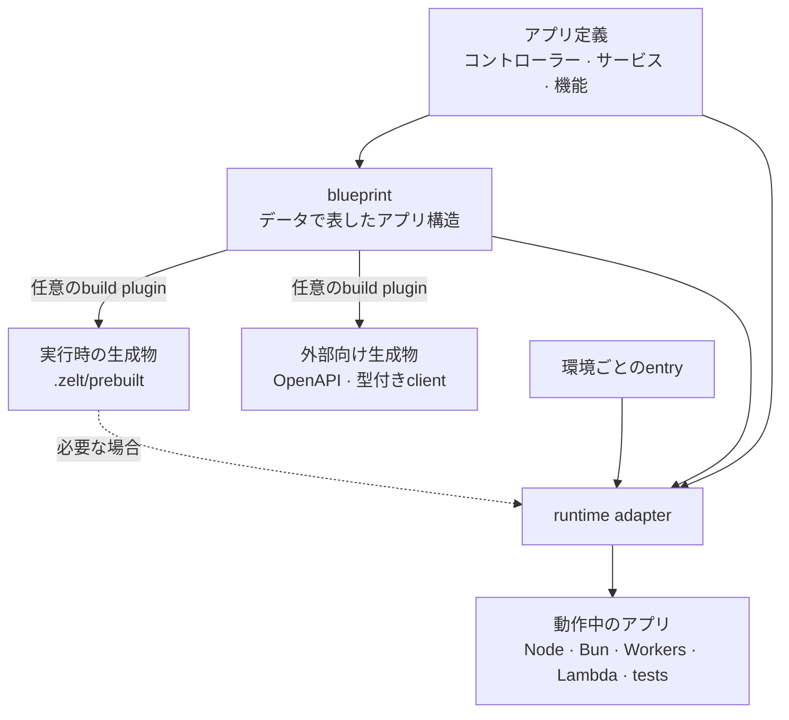
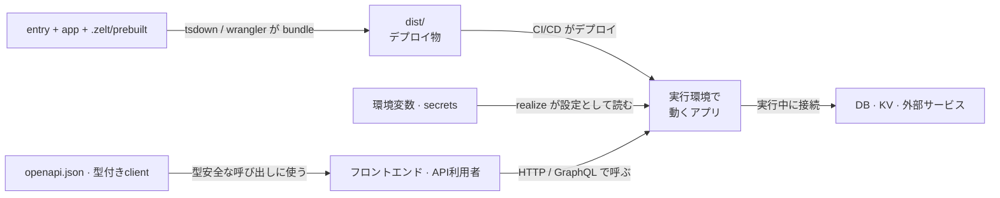

# 全体像

Zeltは、**アプリケーションのコア**と、それを動かす環境を分離します。コントローラー、
サービス、各機能はアプリ定義に置きます。環境ごとの小さなエントリーファイルが、同じアプリを
Node.js、Bun、Workers、Lambda、Electron、またはテスト用のアダプターへ渡します。

Zeltが持ち運べるようにするのは、この境界です。エントリーとインフラ設定は環境ごとに
異なりますが、アプリケーションの振る舞いまで変える必要はありません。

## 30秒で分かるモデル {#the-30-second-model}



小さなNode.jsプロジェクトをファイルで表すと、次のようになります。

```text
src/
├── app.ts          # 持ち運べるアプリケーションコア
└── node.ts         # Node.js固有のエントリー
zelt.config.ts      # 必要な場合のbuild・plugin設定
.zelt/
└── prebuilt.ts     # 必要な場合の実行時生成物
dist/               # bundleされたデプロイ物
```

## 1. アプリ定義: 自分で管理する振る舞い {#app-definition}

`createApp([...])` は、HTTPコントローラー、GraphQLリゾルバー、コマンド、
スケジューラー、それらを支えるサービスを組み立てます。

```typescript
import { Controller, createApp, http } from '@zeltjs/core';
@Controller('/')
class GreetingController {}

// app.ts

export const app = createApp([
  http({ controllers: [GreetingController] }),
]);
```

アプリ定義は `.zelt/` からimportせず、サーバーを起動せず、moduleの評価時に接続を
開かないようにします。この境界があることで、CLIはアプリを安全に調べられ、異なる
アダプターも同じアプリを実行可能な状態にできます。

## 2. Blueprint: データで表したアプリ構造 {#blueprint}

アプリ定義をimportして評価すると、機能とdecoratorのmetadataが集められます。
その結果が **blueprint** です。ルート、リゾルバー、型などの構造情報をデータとして
表します。

build toolとruntime adapterは、どちらもこの設計情報を使います。評価だけでは、
adapterへサーバー起動やインフラ接続を要求しません。アプリ側のmoduleも同じく、
評価時に副作用を起こさない境界を守る必要があります。

## 3. Build生成物: 機能が必要とするときだけ導出 {#build-artifacts}

`zelt build`(および `zelt dev` の再起動のたび)はapp定義をimportして評価します。
その後、任意のpluginがblueprintを使って次のようなものを導出します。

- **`.zelt/prebuilt.ts`** — GraphQLなどの機能が必要とする実行時データ
- **OpenAPI文書と型付きクライアント** — アプリの外から使う契約
- その他、plugin固有の生成物

生成物はアプリ定義から外向きに流れます。entryとテストは `.zelt/prebuilt` を
importできますが、アプリ定義は自分自身の生成物へ依存できません。`.zelt/` は
使い捨て可能で、`zelt build` によって再生成できます。

現在、Zeltがbuild時または起動時に検査するのは、endpoint pathやresolverの集合など、
構造上の整合性です。すべての実装詳細やmethod signatureが全生成物と一致することまでは
証明しません。アプリを変更したら再buildしてください。構造が古い生成物は、
`zelt build` を促すメッセージとともに失敗します。

最後にtsdownやWranglerなどのbundlerが、entryとそのimport先を `dist/` へまとめます。

## 4. Runtime adapter: 副作用が始まる場所 {#runtime-adapter}

entryは実行環境を選び、アプリを渡します。

```typescript
// node.ts
import { onNode } from '@zeltjs/adapter-node';
import { createApp, http } from '@zeltjs/core';
const app = createApp([http({ controllers: [] })]);
// ---cut---
// appは./appからimport

const node = await onNode(app);
await node.http.listen(3000);
```

adapterは設計を**実行可能な状態にする(realize)**役割を持ちます。DI runtimeを作り、
環境設定を読み、lifecycle hookを実行し、実行環境の機能を公開します。その後、
serviceはlifecycleの中でDBや外部serviceへの接続を開けます。

`onNode`、`onBun`、`onCloudflareWorkers`、`onLambda`、`onElectron`、`onTest` は、
それぞれ異なる環境で同じ役割を果たします。小さなentryは変わりますが、app定義は
そのままにできます。

## 持ち運べるものの境界 {#portability-boundary}

| 持ち運べるアプリケーションコア | 環境固有の境界 |
| --- | --- |
| コントローラーとサービス | エントリーファイルとadapter呼び出し |
| DIの依存関係 | 環境変数とsecret |
| バリデーションとビジネスルール | デプロイとbundlerの設定 |
| transportに依存しない機能 | インフラserviceが使うruntime API |

実行環境固有のコードが必要になることもあります。すべての環境に同じAPIがあると仮定せず、
DIで差し替えるserviceの背後か、環境ごとのentryに置いてください。

## テストも同じ境界を使う {#tests-use-the-same-boundary}

テストは別のentryとして振る舞います。アプリと必要なprebuilt dataを `onTest` に渡し、
プロセス内で呼び出します。network portを開かずに、本番と同じアプリ構成とDI lifecycleを
通せます。

## ソースからデプロイまで {#source-to-deployment}

デプロイと運用から見ると、地図はこう繋がります:



次は[Getting Started](./getting-started)でアプリを動かすか、
[Node.jsガイド](./getting-started/node)で具体的なプロジェクト構成を確認してください。
