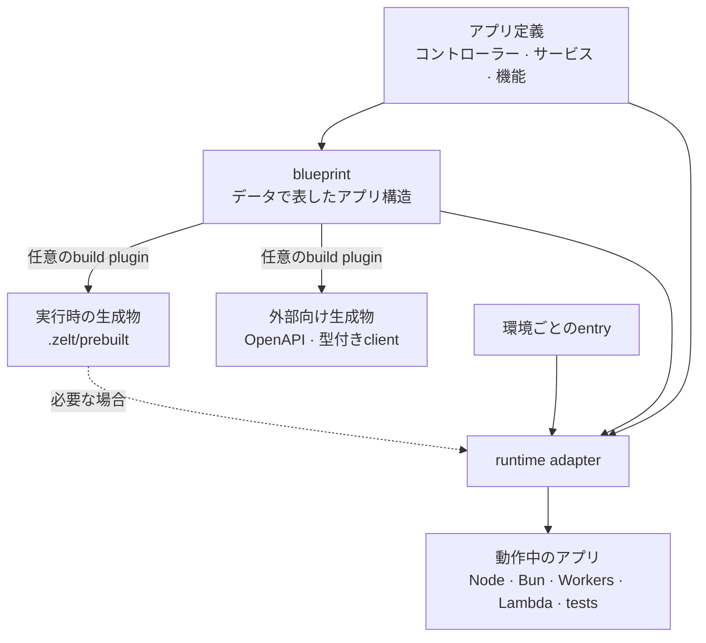
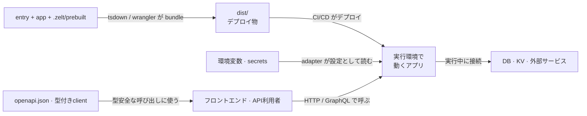

# アーキテクチャ

ZeltJSでは、アプリ定義と実行環境ごとの起動処理を分けます。アプリ定義にはコントローラー、
サービス、各機能を記述します。エントリーファイルは、Node.js、Bun、Cloudflare Workers、AWS Lambda、
Electron、テストのいずれかに対応するアダプターへアプリ定義を渡します。

実行環境固有のコードは、エントリーファイルとインフラ用サービスに置きます。このページでは、
その分離とビルド時に生成されるファイルを説明します。

## 構成要素 {#the-30-second-model}



小さなNode.jsプロジェクトをファイルで表すと、次のようになります。

```text
src/
├── app.ts          # アプリ定義
└── node.ts         # Node.js固有のエントリー
zelt.config.ts      # 必要な場合のビルド・プラグイン設定
.zelt/
└── prebuilt.ts     # 必要な場合に生成される実行時データ
dist/               # バンドル済みのデプロイ成果物
```

## 1. アプリ定義 {#app-definition}

`createApp([...])` は、HTTPコントローラー、GraphQLリゾルバー、コマンド、
スケジューラー、それらを支えるサービスを組み立てます。

```typescript
import { Controller, createApp, http } from '@zeltjs/core';
@Controller('/')
class GreetingController {}

// app.ts

export const app = createApp([
  http({ controllers: [GreetingController] }),
]);
```

アプリ定義は `.zelt/` からimportせず、サーバーを起動せず、モジュールの評価時に接続を
開かないでください。CLIはビルド時にこのファイルをimportし、アダプターは起動時にimportします。

## 2. Blueprint {#blueprint}

アプリ定義をimportして評価すると、機能とdecoratorのmetadataが集められます。
その結果が **blueprint** です。ルート、リゾルバー、型などの構造情報をデータとして
表します。

ビルドツールとアダプターは、どちらもblueprintを使います。アプリ定義の評価ではサーバーを
起動せず、インフラへ接続しません。そのため、アプリ側のモジュールも評価時にこれらの処理を
実行しないでください。

## 3. 生成ファイル {#build-artifacts}

`zelt build` と `zelt dev` の各再起動では、アプリ定義をimportして評価します。その後、
任意のプラグインがblueprintを使って次のファイルを生成できます。

- **`.zelt/prebuilt.ts`** — GraphQLなどの機能が必要とする実行時データ
- **OpenAPI文書と型付きクライアント** — アプリの外から使う契約
- その他、plugin固有の生成物

エントリーとテストは `.zelt/prebuilt` をimportできますが、アプリ定義から自身の生成ファイルを
importしないでください。`.zelt/` ディレクトリは `zelt build` で再生成できます。

現在、Zeltがbuild時または起動時に検査するのは、endpoint pathやresolverの集合など、
構造上の整合性です。すべての実装詳細やmethod signatureが全生成物と一致することまでは
証明しません。アプリを変更したら再buildしてください。構造が古い生成物は、
`zelt build` を促すメッセージとともに失敗します。

その後、tsdownやWranglerなどのバンドラーが、エントリーとimport先を `dist/` にまとめます。

## 4. 実行環境のアダプター {#runtime-adapter}

entryは実行環境を選び、アプリを渡します。

```typescript
// node.ts
import { onNode } from '@zeltjs/adapter-node';
import { createApp, http } from '@zeltjs/core';
const app = createApp([http({ controllers: [] })]);
// ---cut---
// appは./appからimport

const node = await onNode(app);
await node.http.listen(3000);
```

アダプターはDIランタイムを作成し、環境設定を読み、ライフサイクルフックを実行し、実行環境の
機能を提供します。サービスはライフサイクルフックからDBや外部サービスへ接続できます。

`onNode`、`onBun`、`onCloudflareWorkers`、`onLambda`、`onElectron`、`onTest` は、
それぞれ異な環境で同じ役割を果たします。実行環境ごとにエントリーファイルを用意し、
同じアプリ定義を使用できます。

## 実行環境に依存するコード {#portability-boundary}

| 実行環境に依存しないコード | 実行環境に依存するコード |
| --- | --- |
| コントローラーとサービス | エントリーファイルとadapter呼び出し |
| DIの依存関係 | 環境変数とsecret |
| バリデーションとビジネスルール | デプロイとbundlerの設定 |
| transportに依存しない機能 | インフラserviceが使うruntime API |

実行環境固有のコードが必要になることもあります。すべての環境に同じAPIがあると仮定せず、
DIで差し替えるserviceの背後か、環境ごとのentryに置いてください。

## テスト用アダプター {#tests-use-the-same-boundary}

テストはアプリと必要な生成データを `onTest` に渡し、プロセス内で呼び出します。
ネットワークポートを開かずに、アプリ構成とDIライフサイクルを実行できます。

## ビルドとデプロイ {#source-to-deployment}

デプロイに関係するファイルとサービスを次に示します。



アプリを起動する手順は[Getting Started](./getting-started)、プロジェクト全体の例は
[Node.jsガイド](./getting-started/node)を参照してください。
