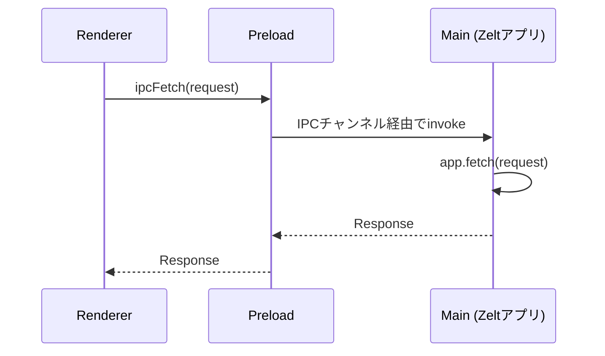

# IPCブリッジ

Electron adapterはHTTPソケットの代わりにElectronのIPC機構を使います。標準の `Request`/`Response` オブジェクトはIPCで安全に扱えるペイロードにシリアライズされ、プロセス間で送受信され、反対側でデシリアライズされます — controllerからは、他のadapterと同じWeb Fetch APIとして見えます。

## 仕組み {#how-it-works}



テキストコンテンツ(JSON、HTML、XML)は文字列としてシリアライズされ、バイナリコンテンツは `ArrayBuffer` としてシリアライズされます。

## 設定 {#configuration}

3層すべてが同じchannel文字列で一致している必要があります:

```typescript
import { createApp, http } from '@zeltjs/core';
import { onElectron } from '@zeltjs/adapter-electron';
import { exposeIpc } from '@zeltjs/adapter-electron/preload';
import { ipcFetch } from '@zeltjs/adapter-electron/renderer';
const app = createApp([http({ controllers: [] })]);
const input = new Request('http://zelt-app/hello');
const init = undefined;
// ---cut---
// main
const electronZelt = await onElectron(app, { ipcChannel: 'http://zelt-app' });

// preload
exposeIpc({ channel: 'http://zelt-app' });

// renderer
ipcFetch(input, init, { channel: 'http://zelt-app' });
```

channelは `http://` または `https://` で始まる必要があります。省略した場合のデフォルトは `'http://zelt-ipc'` です。

## Main Process: `onElectron()` {#main-process-onelectron}

```typescript
import { createApp, http } from '@zeltjs/core';
import { onElectron } from '@zeltjs/adapter-electron';
const app = createApp([http({ controllers: [] })]);
// ---cut---
const electronZelt = await onElectron(app, {
  ipcChannel: 'http://zelt-app',
  warmup: true, // デフォルト: 起動時に全controllerを解決する
});
```

### オプション {#options}

| オプション | 型 | デフォルト | 説明 |
|--------|------|---------|-------------|
| `ipcChannel` | `` `http://${string}` \| `https://${string}` `` | `'http://zelt-ipc'` | IPC channel識別子 |
| `warmup` | `boolean` | `true` | 起動時に全controllerを解決する |
| `ipcFeature` | `string` | `'http'` | 複数の `http()` featureを持つアプリで、IPCブリッジに紐付けるHTTP featureのkey |

### 戻り値(`OnElectronApp`) {#return-value-onelectronapp}

設定された各featureはそのkey(デフォルトは `http`)でnamespace化されます。HTTP featureはさらに、IPCの代わりにTCPで配信するための `listen()` を公開します:

| プロパティ | 型 | 説明 |
|----------|------|-------------|
| `http.fetch` | `(request: Request) => Promise<Response>` | リクエストを直接処理します |
| `http.request` | `(input: string \| Request, init?: RequestInit) => Promise<Response>` | URL/pathと `RequestInit` から組み立てたリクエストを処理します |
| `http.listen` | `(portOrOptions?: number \| ListenOptions) => Promise<ServerHandle>` | このfeatureをIPCではなくTCPで配信します |
| `shutdown` | `() => Promise<void>` | gracefulなシャットダウン |
| `get` | `<T>(Class) => Promise<T>` | DIからserviceを解決します |

破壊的変更: 従来の `electronZelt.fetch` の省略記法は廃止されました — 代わりに `electronZelt.http.fetch`(または `ipcFeature` で設定したkey)を使ってください。

### Warmup {#warmup}

デフォルトでは、`onElectron()` は起動時に全controllerを即時解決します(`warmup: true`)。これにより、最初のリクエストの前にserviceが初期化されていることが保証されます。最初のリクエスト時に遅延初期化したい場合は `warmup: false` を設定してください。

## Preload Script: `exposeIpc()` {#preload-script-exposeipc}

```typescript
import { exposeIpc } from '@zeltjs/adapter-electron/preload';
// ---cut---
exposeIpc({ channel: 'http://zelt-app' });
```

`exposeIpc()` はIPC sender関数を登録し、`contextBridge.exposeInMainWorld()`(context isolationが無効な場合は `globalThis`)経由でrendererに公開します。

公開されるkeyはchannel文字列そのものなので、renderer側の `ipcFetch` は `globalThis[channel]` から参照できます。

## Renderer: `ipcFetch()` {#renderer-ipcfetch}

```typescript
import { ipcFetch } from '@zeltjs/adapter-electron/renderer';
// ---cut---
const response = await ipcFetch('http://zelt-app/hello/world', undefined, {
  channel: 'http://zelt-app',
});
const data = await response.json();
```

`ipcFetch()` は `fetch()` と同じシグネチャに加え、channelを指定する省略可能な第3引数を持ちます。リクエストをIPCペイロードに変換してpreloadブリッジ経由で送信し、標準の `Response` を返します。

### ラッパーを作成する {#creating-a-wrapper}

実際には、channelを一度だけ設定するように `ipcFetch` をラップします:

```typescript
import { ipcFetch } from '@zeltjs/adapter-electron/renderer';
// ---cut---
const CHANNEL = 'http://zelt-app';

export const apiFetch = (input: RequestInfo | URL, init?: RequestInit): Promise<Response> =>
  ipcFetch(input, init, { channel: CHANNEL });
```

### Hono Clientと組み合わせる {#using-with-hono-client}

型安全なAPI呼び出しには、[`@zeltjs/hono-client`](../hono-client)と組み合わせます:

```typescript
import { ipcFetch } from '@zeltjs/adapter-electron/renderer';
declare function hc<T>(baseUrl: string, options?: { fetch: (input: RequestInfo | URL, init?: RequestInit) => Promise<Response> }): T;
// AppTypeはあなたのアプリ定義から @zeltjs/hono-client によって生成されます
declare type AppType = Record<string, unknown>;
// ---cut---
const zeltIpcFetch = (input: RequestInfo | URL, init?: RequestInit): Promise<Response> =>
  ipcFetch(input, init, { channel: 'http://zelt-app' });

export const client = hc<AppType>('http://zelt-app', {
  fetch: zeltIpcFetch,
});
```

`AppType` はアプリ定義から生成されます — CLI plugin(`zelt build`)経由、または、電子ビルドがZelt CLIではなくelectron-viteによって駆動される場合はプログラム的に[`GeneratorService.generateFromApp()`](../hono-client#programmatic-generation)経由で生成されます。main processのビルド成果物をimportできないrendererコードでは、`portable: true` で生成してください。

## IPCイベントへのアクセス {#accessing-the-ipc-event}

controller内では、`ipcEvent()` を使って背後の `IpcMainInvokeEvent` にアクセスできます:

```typescript
import { Controller, Get } from '@zeltjs/core';
import { ipcEvent } from '@zeltjs/adapter-electron';
// ---cut---
@Controller('/system')
export class SystemController {
  @Get('/sender')
  getSender() {
    const event = ipcEvent();
    return { processId: event?.processId };
  }
}
```

## シャットダウン {#shutdown}

Zeltのシャットダウンを、Electronのquitライフサイクルに接続します:

```typescript
import { createApp, http } from '@zeltjs/core';
import { ElectronAdaptor, onElectron } from '@zeltjs/adapter-electron';
const app = createApp([http({ controllers: [] })]);
// ---cut---
const electronZelt = await onElectron(app, { ipcChannel: 'http://zelt-app' });

const electronApp = await electronZelt.get(ElectronAdaptor);
electronApp.ready.app.on('will-quit', () => {
  void electronZelt.shutdown();
});
```

`will-quit` を使うことで、Electronが実際にquitするまでHTTPブリッジが生きたままになり、rendererはteardown中も最後のIPC呼び出しを送信できます。
