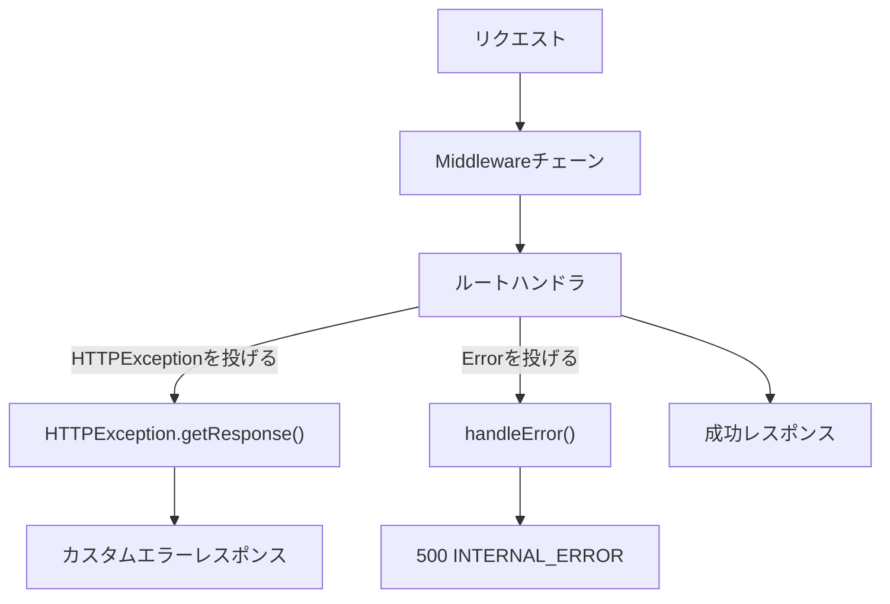

---
---

# Error Handling

Zeltは、Honoの`HTTPException`をベースにしたシンプルなエラーハンドリング機構を提供します。

## Error Response Format {#error-response-format}

全てのエラーは一貫したJSON形式で返されます:

```json
{
  "code": "ERROR_CODE",
  "message": "Error description"
}
```

## Built-in Error Types {#built-in-error-types}

### VALIDATION_FAILED {#validation_failed}

リクエストボディのバリデーションが失敗したときに返されます(ステータス400):

```json
{
  "code": "VALIDATION_FAILED",
  "issues": [
    {
      "kind": "validation",
      "type": "email",
      "message": "Invalid email",
      "path": ["email"]
    }
  ]
}
```

### INTERNAL_ERROR {#internal_error}

未処理のエラーが発生したときに返されます(ステータス500):

```json
{
  "code": "INTERNAL_ERROR",
  "message": "internal server error"
}
```

開発モード(`NODE_ENV=development`)では、デバッグのために実際のエラーメッセージが含まれます。

## Throwing HTTPExceptions {#throwing-httpexceptions}

Honoの`HTTPException`を使い、ステータスコードとメッセージまたはカスタムレスポンスを指定してHTTPエラーを投げます。

### Custom Message {#custom-message}

基本的なテキストレスポンスの場合は、エラーの`message`を設定するだけです:

```typescript
import { HTTPException } from '@zeltjs/core';

throw new HTTPException(401, { message: 'Unauthorized' });
```

### Custom Response {#custom-response}

JSONレスポンスやレスポンスヘッダーの設定には`res`オプションを使います。

```typescript
import { HTTPException } from '@zeltjs/core';

const errorResponse = Response.json(
  { code: 'USER_NOT_FOUND', message: 'User not found' },
  { status: 404 }
);

throw new HTTPException(404, { res: errorResponse });
```

カスタムヘッダー付きの場合:

```typescript
import { HTTPException } from '@zeltjs/core';
// ---cut---
const errorResponse = new Response('Unauthorized', {
  status: 401,
  headers: {
    'WWW-Authenticate': 'Bearer error="invalid_token"',
  },
});

throw new HTTPException(401, { res: errorResponse });
```

### Cause {#cause}

デバッグのために元のエラーを付加するには`cause`オプションを使います:

```typescript
import { Middleware, HTTPException, type RequestContext, type Next } from '@zeltjs/core';

async function authorize(c: RequestContext): Promise<void> {
  const token = c.req.header('Authorization');
  if (!token) throw new Error('No token');
}

@Middleware
class AuthMiddleware {
// ---cut---
  async use(c: RequestContext, next: Next) {
    try {
      await authorize(c);
    } catch (cause) {
      throw new HTTPException(401, { message: 'Authorization failed', cause });
    }
    await next();
    return undefined;
  }
}
```

## Custom Error Codes {#custom-error-codes}

APIの一貫性を保つため、再利用可能なエラーレスポンスを定義します:

```typescript
import { HTTPException } from '@zeltjs/core';

const notFoundResponse = Response.json(
  { code: 'USER_NOT_FOUND', message: 'User not found' },
  { status: 404 }
);

const forbiddenResponse = Response.json(
  { code: 'FORBIDDEN', message: 'Access denied' },
  { status: 403 }
);

// 使用例
throw new HTTPException(404, { res: notFoundResponse });
throw new HTTPException(403, { res: forbiddenResponse });
```

または、ファクトリ関数を作成します:

```typescript
import { HTTPException } from '@zeltjs/core';
// ---cut---
const createErrorResponse = (
  status: number,
  code: string,
  message: string
): Response => {
  return Response.json({ code, message }, { status });
};

// 使用例
const response = createErrorResponse(404, 'USER_NOT_FOUND', 'User not found');
throw new HTTPException(404, { res: response });
```

## Error Types for OpenAPI {#error-types-for-openapi}

組み込みのエラー型を使って、OpenAPI仕様書にエラーレスポンスをドキュメント化します:

```typescript
import type { ErrorBody, ValidationErrorBody } from '@zeltjs/core';
```

これらの型はエラーレスポンスの構造を定義します:

- `ErrorBody` — 全てのエラー型のUnion(VALIDATION_FAILED | INTERNAL_ERROR)
- `ValidationErrorBody` — バリデーションエラー型のみ

## Error Handling Flow {#error-handling-flow}



## Custom Error Handlers {#custom-error-handlers}

より複雑なエラーハンドリングロジックには、`@ErrorHandler`デコレータを使って再利用可能なエラーハンドラクラスを作成します。

### Creating an Error Handler {#creating-an-error-handler}

```typescript
import { ErrorHandler, RequestContext } from '@zeltjs/core';

@ErrorHandler
class DatabaseErrorHandler {
  onError(error: Error, c: RequestContext): Response | undefined {
    if (error.name === 'PrismaClientKnownRequestError') {
      return Response.json(
        { code: 'DATABASE_ERROR', message: 'Database operation failed' },
        { status: 409 }
      );
    }
    return undefined;
  }
}
```

`onError`メソッドは次を受け取ります:
- `error` — 投げられたエラー
- `c` — Honoのリクエストcontext

エラーを処理する場合は`Response`を返し、次のハンドラへ渡す場合は`undefined`を返します。

### Registering Error Handlers {#registering-error-handlers}

`errorHandlers`オプションを通じて、`controllers`付きの`http(...)`featureへエラーハンドラを渡します:

```typescript
import { createApp, Controller, Get, ErrorHandler, RequestContext, http } from '@zeltjs/core';

@Controller('/users') class UserController { @Get('/') findAll() { return { users: [] }; } }
@ErrorHandler class DatabaseErrorHandler { onError(error: Error, c: RequestContext) { return undefined; } }
@ErrorHandler class ValidationErrorHandler { onError(error: Error, c: RequestContext) { return undefined; } }
// ---cut---
const app = createApp([http({
    controllers: [UserController],
    errorHandlers: [DatabaseErrorHandler, ValidationErrorHandler],
  })]);
```

### Handler Chain {#handler-chain}

エラーハンドラは、`http({ errorHandlers: [...] })`で登録された順序で実行されます:

1. 最初のハンドラの`onError`が呼ばれる
2. `undefined`が返された場合、次のハンドラが呼ばれる
3. 全てのハンドラが`undefined`を返した場合、デフォルトのエラーハンドラが実行される

```typescript
import { createApp, Controller, Get, ErrorHandler, RequestContext, http } from '@zeltjs/core';

class CustomError extends Error {}
@Controller('/') class MyController { @Get('/') index() { return { ok: true }; } }
// ---cut---
@ErrorHandler
class FirstHandler {
  onError(error: Error, c: RequestContext) {
    if (error instanceof CustomError) {
      return Response.json({ code: 'CUSTOM' }, { status: 400 });
    }
    return undefined;
  }
}

@ErrorHandler
class FallbackHandler {
  onError(error: Error, c: RequestContext) {
    console.error('Unhandled error:', error);
    return undefined;
  }
}

createApp([http({
    controllers: [MyController],
    errorHandlers: [FirstHandler, FallbackHandler],
  })]);
```

### Dependency Injection {#dependency-injection}

エラーハンドラは依存性注入をサポートしています。serviceへアクセスするにはコンストラクタ注入を使います:

```typescript
import { ErrorHandler, RequestContext, inject } from '@zeltjs/core';
declare class LoggerService { error(msg: string, ctx: object): void; }
// ---cut---
@ErrorHandler
class LoggingErrorHandler {
  constructor(private logger = inject(LoggerService)) {}

  onError(error: Error, c: RequestContext) {
    this.logger.error('Request failed', { error, path: c.req.path });
    return undefined;
  }
}
```

## Framework Error Classes {#framework-error-classes}

Zeltはフレームワークレベルのエラーのための構造化されたエラークラスを提供します。これらのクラスは一貫した命名規則(`Zelt*Error`)に従い、デバッグ用の型付きcontextを含みます:

| Error Class | Description |
|------------|-------------|
| `ZeltDecoratorUsageError` | デコレータの不正な使用(例: staticメソッドへの適用) |
| `ZeltLifecycleStateError` | 不正なライフサイクル状態(例: shutdown後のメソッド呼び出し) |
| `ZeltContextNotAvailableError` | 実行context外でのprimitive呼び出し |
| `ZeltAppConfigurationError` | 不正なアプリ設定 |
| `ZeltRouteConfigurationError` | 不正なルート設定 |
| `ZeltMiddlewareExecutionError` | middlewareの実行エラー(例: next()の複数回呼び出し) |
| `ZeltNotImplementedError` | メソッドが未実装 |
| `ZeltSchemaValidationError` | 不正なschema定義 |

### Usage {#usage}

```typescript
import { ZeltAppConfigurationError } from '@zeltjs/core';

try {
  // ...
} catch (error) {
  if (error instanceof ZeltAppConfigurationError) {
    console.log(error.context.reason); // 'no_http_or_commands' | 'duplicate_command'
  }
}
```

### Error Context {#error-context}

各エラークラスは、構造化された情報を持つ`context`プロパティを含みます:

```ts twoslash
// @noErrors
// Reason: 型のみの例でランタイムコードがないため
// ZeltDecoratorUsageErrorのcontext
type DecoratorUsageErrorContext = {
  decoratorName: string;
  reason: 'static_method' | 'missing_decorator';
  targetName?: string;
}

// ZeltLifecycleStateErrorのcontext
type LifecycleStateErrorContext = {
  operation: string;
  currentState: 'disposed' | 'ready' | 'not_ready';
}
```

## Best Practices {#best-practices}

1. **説明的なエラーコードを使う** — `NOT_FOUND`より`USER_NOT_FOUND`を優先する
2. **実用的なメッセージを含める** — APIの利用者が何が起きたかを理解できるようにする
3. **内部の詳細を露出させない** — 本番環境ではスタックトレースや内部エラーメッセージを含めない
4. **エラーレスポンスをドキュメント化する** — OpenAPI schemaを使って全ての起こりうるエラーコードをドキュメント化する
5. **エラーハンドラを具体性の高い順に並べる** — 汎用的なハンドラより具体的なハンドラを先に置く
6. **フレームワークのエラーを使う** — `Zelt*Error`クラスを捕捉して、フレームワーク固有の問題を処理する
