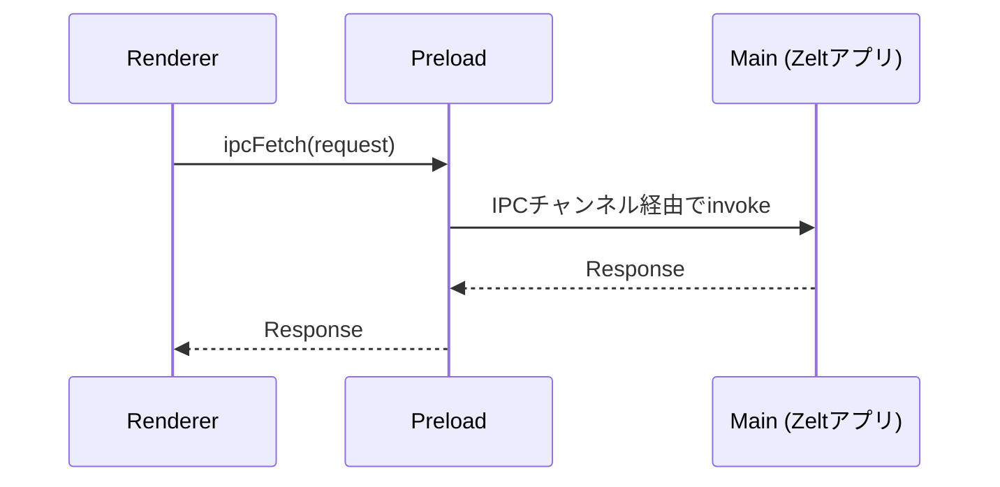

import Prerequisites from './_partials/prerequisites.mdx';

# Electronではじめる

このガイドでは、ElectronアプリにZeltアプリケーションを組み込む手順を説明します。

<Prerequisites />

Electronでは追加で以下が必要です:
- [Electron](https://www.electronjs.org/) — 最小バージョンは `@zeltjs/adapter-electron` のpeer dependencyを参照してください
- [electron-vite](https://electron-vite.org/)(推奨)

## インストール {#installation}

```bash
pnpm add @zeltjs/core @zeltjs/adapter-electron
pnpm add -D electron electron-vite
```

## アーキテクチャ概要 {#architecture-overview}

サーバーベースのadapter(Node.js、Bun)とは異なり、Electron adapterはHTTPソケットの代わりにIPCで通信します。あなたのZeltアプリは**main process**で動作し、rendererはIPCブリッジを通じてそれを呼び出します:



必要なのは3つの要素です:
1. **Main process** — `onElectron(app)` がZeltを起動し、IPCハンドラを登録します
2. **Preloadスクリプト** — `exposeIpc()` がIPCをrendererへブリッジします
3. **Renderer process** — `ipcFetch()` がブリッジ経由でリクエストを送信します

## プロジェクト構成 {#project-structure}

```
my-electron-app/
├── src/
│   ├── main/
│   │   ├── entry/
│   │   │   └── hello.controller.ts
│   │   ├── app.ts           # Zeltアプリ定義
│   │   └── index.ts         # Electron mainエントリ
│   ├── preload/
│   │   └── index.ts         # IPCブリッジのセットアップ
│   └── renderer/
│       └── src/
│           └── api/
│               └── zeltFetch.ts  # IPC fetchラッパー
├── electron.vite.config.ts
├── package.json
└── tsconfig.json
```

## Hello World {#hello-world}

### Step 1: Controllerを作成する {#step-1-create-the-controller}

`src/main/entry/hello.controller.ts` を作成します:

```typescript
import { Controller, Get, request } from '@zeltjs/core';
// ---cut---
@Controller('/hello')
export class HelloController {
  @Get('/:name')
  greet(req = request()) {
    const name = req.pathParam('name');
    return { message: `Hello, ${name}!` };
  }
}
```

### Step 2: アプリケーションを作成する {#step-2-create-the-application}

`src/main/app.ts` を作成します:

```typescript
import { createApp, Controller, Get, request, http } from '@zeltjs/core';
@Controller('/hello')
class HelloController {
  @Get('/:name')
  greet(req = request()) { const name = req.pathParam('name'); return { message: `Hello, ${name}!` }; }
}
// ---cut---
export const app = createApp([http({
    controllers: [HelloController],
  })]);
```

### Step 3: Main Processで初期化する {#step-3-initialize-in-main-process}

`src/main/index.ts` を作成します:

```typescript
import { createApp, Controller, Get, request, http } from '@zeltjs/core';
import { onElectron } from '@zeltjs/adapter-electron';
@Controller('/hello')
class HelloController {
  @Get('/:name')
  greet(req = request()) { const name = req.pathParam('name'); return { message: `Hello, ${name}!` }; }
}
const app = createApp([http({ controllers: [HelloController] })]);
declare const BrowserWindow: any;
declare const join: (...args: string[]) => string;
// ---cut---
const bootstrap = async () => {
  const electronZelt = await onElectron(app, {
    ipcChannel: 'http://zelt-app',
  });

  const win = new BrowserWindow({
    width: 900,
    height: 670,
    webPreferences: {
      preload: join(__dirname, '../preload/index.js'),
      contextIsolation: true,
      sandbox: true,
    },
  });
  win.loadFile(join(__dirname, '../renderer/index.html'));
};

void bootstrap();
```

`onElectron()` はZeltランタイムを起動し、指定されたchannelのIPCハンドラを自動的に登録します。返されるのは:

- `http.fetch(request)` — `Request` を処理して `Response` を返します(設定された各featureはそのkeyでnamespace化されます。デフォルトは `http`)
- `shutdown()` — アプリケーションをgracefulにシャットダウンします
- `get<T>(Class)` — DIコンテナからserviceを解決します

:::important
`webPreferences.preload` のパスは、コンパイル済みのpreloadスクリプトを指している必要があります。指定しないと `exposeIpc()` が実行されず、rendererはZeltアプリに到達できません。
:::

### Step 4: Preloadスクリプトをセットアップする {#step-4-set-up-the-preload-script}

`src/preload/index.ts` を作成します:

```typescript
import { exposeIpc } from '@zeltjs/adapter-electron/preload';
// ---cut---
exposeIpc({ channel: 'http://zelt-app' });
```

`exposeIpc()` はElectronの `contextBridge` を使って、IPC senderをrendererへ安全に公開します。

### Step 5: RendererからAPIを呼び出す {#step-5-call-api-from-renderer}

`src/renderer/src/api/zeltFetch.ts` を作成します:

```typescript
import { ipcFetch } from '@zeltjs/adapter-electron/renderer';
// ---cut---
export const zeltFetch = (input: RequestInfo | URL, init?: RequestInit): Promise<Response> =>
  ipcFetch(input, init, { channel: 'http://zelt-app' });
```

標準の `fetch()` と同じように使います:

```typescript
import { ipcFetch } from '@zeltjs/adapter-electron/renderer';
const zeltFetch = (input: RequestInfo | URL, init?: RequestInit): Promise<Response> =>
  ipcFetch(input, init, { channel: 'http://zelt-app' });
// ---cut---
const response = await zeltFetch('http://zelt-app/hello/world');
const data = await response.json();
console.log(data.message); // "Hello, world!"
```

:::important
channel文字列(例: `'http://zelt-app'`)は、main・preload・rendererの3層すべてで一致している必要があります。
:::

## 次のステップ {#whats-next}

- [Electron — IPC Bridge](../electron/ipc-bridge) — IPCブリッジの詳しい仕組み
- [Electron — Window Management](../electron/window-management) — Zelt DIを通じたBrowserWindowの管理
- [Controllers](../controllers) — ルーティングとHTTPメソッド
- [Services](../services) — ビジネスロジックと依存性注入
