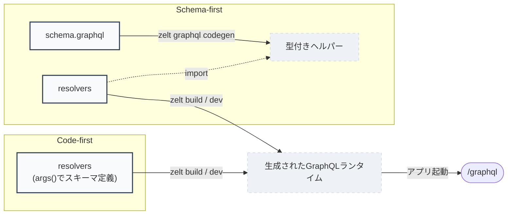

# GraphQL

`@zeltjs/graphql` は実験的です。runtime manifestの形状と生成されるhelper APIは、安定版リリースまでに変更される可能性があります。

GraphQLサポートは、共有のruntime manifestを中心に構築されています:

- `schemaSdl`
- resolverのbinding
- enum・scalar・unionのマッピングなどのruntime metadata

executorはruntime manifestを消費します。Code-firstとSchema-firstは同じmanifestを生成するフロントエンドであり、そのmanifestはアプリ自身がロードするのではなく、prebuiltモジュールとして実行中のアプリへ届けられます。



実線のノードはあなたが編集する正(source of truth)、点線のノードはコマンドが作る生成物です。正を変更したら、そこから出るエッジのコマンドを再実行してください — 古い生成物のまま進めると型エラーやビルドエラーとして現れます。

## API boundary {#api-boundary}

サポートされる実験的なapp-authoring API:

- `graphql()`
- `Resolver`
- `Query`
- `Mutation`
- `ResolveField`
- `args()`
- `gqlScalar()`
- `GqlOutput`

`graphql({ path, resolvers, schema? })` はendpointを宣言します。そのendpointがcode-firstかschema-firstかは、`schema` が渡されているかどうかによってendpointごとに決まります: code-firstの場合は省略し、schema-firstの場合は `zelt graphql codegen` が生成したhelperの `schema` exportを渡します。いずれの場合も、`graphql()` は生成されたruntimeを直接参照することはありません — それはadapterの `prebuilt` オプションを通じて別途供給されます(下記のBuild flowを参照)。

各endpointは識別用のkeyを持ちます: `graphql({ path, resolvers, name })` — オプションの `name` で、省略時のデフォルトは `'graphql'`、`http()` の `name` オプションと同じ規約です。このkeyは、そのendpointのprebuilt entryと生成されるファイル名をnamespace化します。複数の `graphql()` をmountするには、endpointごとに異なる `name` が必要です。2つのendpointが同じkeyを共有するとbuild時エラーになります。`name` は `/^[A-Za-z0-9_-]+$/` にマッチしなければならず、予約済みのWindowsデバイス名(`CON`、`PRN`、`AUX`、`NUL`、`COM1`-`9`、`LPT1`-`9`)であってはいけません。`graphql()` は不正な `name` に対して即座にthrowします。endpointの組み合わせは自由です — 複数のschema-first行、複数のcode-first行、あるいはその両方を混在させても、同じapp内に共存できます。各行は自身のschema(またはresolverから導出されたSDL)とresolverだけをbindします。

生成コード用のAPIは、schema-firstのhelper専用にexportされます:

- `readGraphqlArgs()`
- `validateGraphqlArgs()`

`graphqlPlugin()`、`generateGraphqlSdl()`、`generateSdlForResolvers()`、schema-first codegen、metadataの検査、型変換といったbuild時APIは、`@zeltjs/graphql/codegen` からのみexportされます。

adapterとframework内部で使われるruntime統合API — `createGraphqlExecutor()`、`executeGraphqlRequest()`、`GraphqlRuntimeManifest`、`GeneratedGraphqlRuntime`、`GraphqlPrebuiltEntry`、`computeGraphqlPrebuiltHash()` を含む — は `@zeltjs/graphql` に残ります。アプリケーションコードが通常これらを必要とすることはありません。

## Code-first {#code-first}

```ts no-check
import { createApp, http } from '@zeltjs/core';
import { args, graphql, Query, Resolver } from '@zeltjs/graphql';
import * as v from 'valibot';

const GetProductInput = v.object({
  id: v.string(),
});

type Product = {
  readonly id: string;
  readonly name: string;
};

@Resolver()
class ProductResolver {
  @Query()
  product(input = args(GetProductInput)): Product {
    return { id: input.id, name: 'Keyboard' };
  }
}

export const app = createApp([
  http({
    children: [
      graphql({
        path: '/graphql',
        resolvers: [ProductResolver],
      }),
    ],
  }),
]);
```

`args(schema)` は、Standard SchemaからGraphQLのfield引数を定義し、runtime時にvalidationを行います。

## Schema-first {#schema-first}

```graphql
type Query {
  product(id: ID!): Product
}

type Product {
  id: ID!
  name: String!
}
```

```bash
zelt graphql codegen --schema src/graphql/schema.graphql --out src/generated/graphql.ts
```

これにより、型付きhelperの `Gql` namespaceと、このschemaを識別する `schema` export(`{ sdl }`)を持つ `src/generated/graphql.ts` が書き出されます。また、`<cwd>/.zelt/graphql-codegen.json` へエントリをupsertし、schemaのcontent hashとこのhelperのパスをペアリングします — `graphqlPlugin()` は後で、あるendpointのresolverChecksをどこに書くかを見つけるために、このペアリングを利用します(下記のBuild flowを参照)。

```ts no-check
import { Query, Resolver } from '@zeltjs/graphql';
import { Gql } from '../../generated/graphql';

@Resolver()
class ProductResolver {
  @Query()
  product(input = Gql.Query.product.args()): Gql.Query.product.Result {
    return { id: input.id, name: 'Keyboard' };
  }
}
```

このhelperの `schema` exportを `graphql()` に渡すことで、endpointをそれにbindします:

```ts no-check
import { createApp, http } from '@zeltjs/core';
import { graphql } from '@zeltjs/graphql';
import { schema } from './generated/graphql';
import { ProductResolver } from './graphql/product.resolver';

export const app = createApp([
  http({
    children: [
      graphql({
        path: '/graphql',
        resolvers: [ProductResolver],
        schema,
      }),
    ],
  }),
]);
```

各schema-firstの `graphql()` endpointは、このようにしてschemaとペアリングされます — plugin設定を通じてではなく、アプリケーションコード内でです。ペアリングが `graphql()` の呼び出し箇所にあるため、appは複数のschema-first行(あるいはschema-firstとcode-firstを混在させた行)を、それぞれ独自の `name` を持たせて並べてmountできます:

```ts no-check
graphql({ name: 'storefront', path: '/graphql', resolvers: [...], schema: storefrontSchema }),
graphql({ name: 'admin', path: '/admin/graphql', resolvers: [...], schema: adminSchema }),
```

`storefrontSchema` と `adminSchema` は、それぞれ独自の `--out` を持つ2つの別々の `zelt graphql codegen` 実行から生成されます。この2つの行がresolverやschemaを共有することは決してありません — `/graphql` に送られたqueryはstorefront schemaのfieldのみを見ることができ、`/admin/graphql` に送られたqueryはadmin schemaのfieldのみを見ることができます。

生成されたhelperには、追加のruntime validationを重ねることができます:

```ts no-check
@Query()
product(input = Gql.Query.product.args(GetProductInput)): Gql.Query.product.Result {
  return { id: input.id, name: 'Keyboard' };
}
```

schema-firstモードでは、SDLがsource of truthであり続けます。生成されたargs helperに渡されたStandard Schemaは、追加のvalidationとして扱われます。

`args<T>()` は意図的にuser-facing APIには含まれていません。Schema-firstの型は、手書きのgeneric引数ではなく、生成されたhelperから得るべきです。

## Build flow {#build-flow}

build生成のruntime出力 — `.zelt/` 配下のすべて — をimportするのは、platform entryファイルだけです。app定義がそれをimportすることはないため、初めてappをbuildするときにchicken-and-eggの問題が発生することはありません。Schema-first appは生成コード(`zelt graphql codegen` が `src/generated/graphql.ts` に書き出す型付きhelper)をimportしますが、codegenは `schema.graphql` から直接実行され、appを評価する必要がないため、こちらでもchicken-and-eggの問題は発生しません。

```ts no-check
import { graphqlPlugin } from '@zeltjs/graphql/codegen';
```

`zelt.config.ts` にpluginを登録します:

```ts no-check
import { defineConfig } from '@zeltjs/cli';
import { graphqlPlugin } from '@zeltjs/graphql/codegen';

export default defineConfig({
  app: () => import('./src/app').then((m) => m.app),
  plugins: [graphqlPlugin()],
  build: { entry: './src/node.ts' },
  dev: { entry: './src/node.ts' },
});
```

その後、`zelt build` と `zelt dev` は2つの生成ステップを自動的に実行します:

1. 登録された各 `graphqlPlugin()` は、`graphql({ path, resolvers })` のendpointごとに1組、`.zelt/graphql/<key>.runtime.ts`(`export const graphqlPrebuilt = { runtime, resolversHash }`)と対になる `.graphql` SDLファイルを書き出します。`<key>` はendpointのvalidateされたkey(その `name`、省略時は `graphql`。上記参照)であり、2つの `graphql()` endpointが衝突するのはkeyを共有した場合のみです — 区別するには、それぞれに異なる `name` を渡してください。
2. CLIはすべてのpluginの成果物を集約し、`.zelt/prebuilt.ts`(`export const zeltPrebuilt = {...} satisfies ZeltPrebuilt`)を書き出します。これは、生成された各モジュールをそのkeyのもとでre-exportし、`graphql` featureの下にnamespace化します。このファイルは、pluginが何も貢献しない場合でも常に生成されます。

platform entryファイルは `zeltPrebuilt` を静的にimportし、adapterに渡します:

```ts no-check
import { onNode } from '@zeltjs/adapter-node';
import { app } from './app';
import { zeltPrebuilt } from '../.zelt/prebuilt';

const nodeApp = await onNode(app, { prebuilt: zeltPrebuilt });
```

すべてのadapter(`onNode`、`onBun`、`onCloudflareWorkers`、`onElectron`、`onLambda`)は同じ `prebuilt` オプションを受け付けます。entryファイルは静的な `import` のみを使うため、これはCloudflare Workersの `wrangler` bundleのような、静的importを要求するbundler下でも変更なしに動作します — どのplatformにもファイルシステムへのfallbackはありません。

1つの `graphqlPlugin()` が、app内のすべてのendpoint — code-first、schema-first、あるいはその混在 — を処理します。各endpointが自身の行を持つためです(上記のAPI boundaryを参照)。それらを選択するための `mode` オプションはありません。

### Code-first {#code-first-1}

1. resolverを書く。
2. `graphql({ path, resolvers })` を設定する。
3. `zelt.config.ts` の `plugins` に `graphqlPlugin()` を追加する。
4. `zelt build` または `zelt dev` を実行する。
5. platform entryファイルが `../.zelt/prebuilt` から `zeltPrebuilt` をimportし、adapterに渡す。

### Schema-first {#schema-first-1}

1. `schema.graphql` を書く。
2. `zelt graphql codegen --schema ... --out ...` を実行する。
3. 生成された `Gql` helperを使ってresolverを書く。
4. helperの `schema` exportを渡して `graphql({ path, resolvers, schema })` を設定する。
5. `zelt.config.ts` の `plugins` に `graphqlPlugin()` を追加する(code-firstと同じ — schema-first固有のオプションはない)。
6. `zelt build` または `zelt dev` を実行する。
7. platform entryファイルが `../.zelt/prebuilt` から `zeltPrebuilt` をimportし、adapterに渡す。

別のschema-first行を追加するには、異なる `--out` とendpointごとに異なる `name` を使ってステップ1〜4を繰り返します。

`zelt dev` 中の自動schema-first codegenは、この時点のリリース範囲には含まれません。`schema.graphql` が変更されるたびに、`zelt build`/`zelt dev` の前に明示的に `zelt graphql codegen` を実行してください — codegen manifestのエントリ(`<cwd>/.zelt/graphql-codegen.json`)が欠落または古い場合、buildは再実行を促すエラーで失敗します。

schema-firstの各endpointには、各resolverメソッドの戻り値の型が、対応する生成された `Gql.Query`/`Gql.Mutation` の結果型に代入可能であることをassertする型チェックファイルが自動的に付与されます。これは、endpointのschemaがhashするcodegen helperの隣に書き出されます(`<helper>.resolver-checks.ts`、あるいは2つのendpointが1つのhelperを共有する場合は `<helper>.<name>.resolver-checks.ts`) — これに設定はありません。`graphqlPlugin()` はcodegen manifestを通じてペアリングを検出します。

## Current limitations {#current-limitations}

GraphQLはprebuiltモジュールを必要とします。それが欠落している場合、endpointのprebuilt entryが欠落している場合、あるいはentryファイルが `zeltPrebuilt` をimportしていない場合、そのendpointは起動時にthrowします — どのplatformにもsilentなfallbackはありません。

各endpointは、そのkey(endpointの `name`、省略時は `graphql`)によってprebuiltモジュール内で検索されます。そのkeyの下にエントリが存在しない場合 — prebuiltにそのendpointが欠けているか、まだbuildされていないため — 起動時にthrowし、`zelt build` の再実行を促します。エントリが見つかると、そこに埋め込まれた `resolversHash`(endpointのpathとソートされたresolverクラス名に対するSHA-256フィンガープリント)が、実行中の `graphql({ path, resolvers })` 宣言から再計算された値と照合されます。不一致は、prebuilt entryが現在のresolverに対して古いことを意味し、起動時に `zelt build` の再実行を促すthrowが発生します。v1はendpointのpathとresolverクラス名のみをフィンガープリントします — resolverメソッドのシグネチャ、引数の型、戻り値の型の変更は検出されず、`zelt build` を手動で再実行する必要があります。

### Code-first {#code-first-2}

- 出力型のサポートは意図的に狭く保たれています。
- 複雑なGraphQLインターフェースはサポートが限定的です。
- Code-firstは、custom scalar codecとnamed unionを実験的にサポートしています。
- フィールド名はデフォルトでメソッド名になります。可能な場合、decoratorを通じて明示的な名前もサポートされます。
- フィールドの引数はStandard Schemaによるruntime validationを使い、SDL生成にはschema adapterが必要です。

### Schema-first {#schema-first-2}

- Schema-first codegenは、現時点では組み込みscalar、object型、`Query`、`Mutation` をサポートしています。
- custom scalar、enum、union、interface、input objectは、意図的に制限されているか、今後に見送られています。
- custom scalar codecとnamed unionに対するschema-firstのサポートはまだ限定的で、今後別途拡張される予定です。
- ルートの `Query` と `Mutation` のfieldにはresolver bindingが必須です。
- Object型のfieldは、GraphQLのデフォルトのfield resolutionに頼ることができます。
- 生成された `Gql.Query.<field>.args()` helperが、schema-firstのメインのargs APIです。
- user-facingな `args<T>()` は意図的にサポートされていません。
