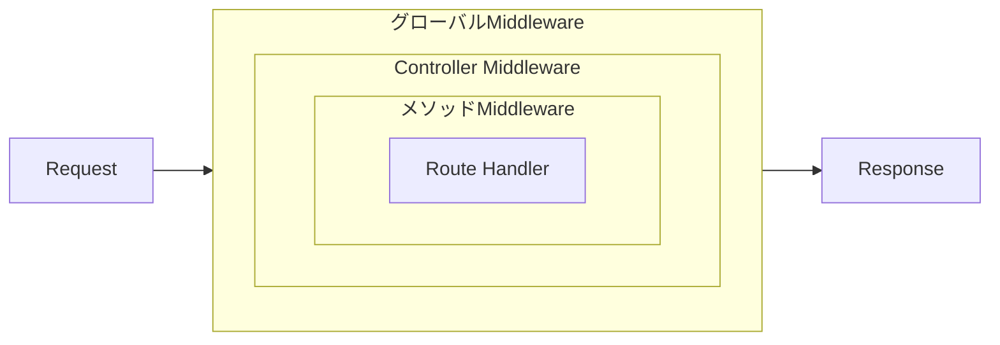

---
---

# Middleware

Middlewareクラスはルートハンドラの前に実行され、リクエスト、レスポンス、またはcontextを変更できます。

## Class Middleware {#class-middleware}

最もシンプルなmiddlewareの形は、`use()`メソッドを持つクラスです。HTTP primitiveへアクセスするには`request()`と`response()`を使います:

```typescript
import { Middleware, request, type Next } from '@zeltjs/core';

@Middleware
export class LoggingMiddleware {
  async use(next: Next, req = request()): Promise<Response | undefined> {
    const start = Date.now();
    await next();
    const duration = Date.now() - start;
    console.log(`[${req.method()}] ${req.path()} ${duration}ms`);
    return undefined;
  }
}
```

## Middleware Levels {#middleware-levels}

Zeltは3つのレベルでmiddlewareをサポートしており、**global → controller → method**の順に実行されます。

### Global Middleware {#global-middleware}

`createApp()`を通じて全てのルートへ適用します:

```typescript
import { createApp, Controller, Get, Middleware, request, type Next, http } from '@zeltjs/core';

@Middleware
class LoggingMiddleware {
  async use(next: Next, req = request()) {
    const start = Date.now();
    await next();
    console.log(`[${req.method()}] ${req.path()} ${Date.now() - start}ms`);
    return undefined;
  }
}
@Controller('/users') class UserController { @Get('/') findAll() { return []; } }
// ---cut---
export const app = createApp([http({
    controllers: [UserController],
    middlewares: [LoggingMiddleware],
  })]);
```

### Controller Middleware {#controller-middleware}

`@UseMiddleware`でcontroller内の全メソッドへ適用します:

```typescript
import { Controller, Get, Middleware, UseMiddleware, type Next } from '@zeltjs/core';

@Middleware
class AuthMiddleware { async use(next: Next) { await next(); return undefined; } }
// ---cut---
@UseMiddleware(AuthMiddleware)
@Controller('/admin')
export class AdminController {
  @Get('/dashboard')
  dashboard() {
    return { stats: [] };
  }
}
```

### Method Middleware {#method-middleware}

特定のメソッドへ適用します:

```typescript
import { Controller, Delete, Get, Middleware, UseMiddleware, request, type Next } from '@zeltjs/core';

@Middleware
class AdminOnlyMiddleware { async use(next: Next) { await next(); return undefined; } }
// ---cut---
@Controller('/posts')
export class PostController {
  @Get('/')
  findAll() {
    return { posts: [] };
  }

  @UseMiddleware(AdminOnlyMiddleware)
  @Delete('/:id')
  remove(req = request()) {
    const id = req.pathParam('id');
    return { deleted: id };
  }
}
```

## Skipping Middleware {#skipping-middleware}

`@SkipMiddleware`を使うと、特定のmiddlewareをメソッドから除外できます:

```typescript
import { Controller, Get, Middleware, SkipMiddleware, type Next } from '@zeltjs/core';

@Middleware
class AuthMiddleware { async use(next: Next) { await next(); return undefined; } }
// ---cut---
@Controller('/api')
export class ApiController {
  @Get('/protected')
  protected() {
    return { secret: 'data' };
  }

  @SkipMiddleware(AuthMiddleware)
  @Get('/health')
  health() {
    return { status: 'ok' };
  }
}
```

`@SkipMiddleware`をcontrollerクラスに適用すると、そのcontroller内の全てのルートからmiddlewareを除外できます:

```typescript
import { Controller, Get, Middleware, SkipMiddleware, type Next } from '@zeltjs/core';

@Middleware
class AuthMiddleware { async use(next: Next) { await next(); return undefined; } }
// ---cut---
@SkipMiddleware(AuthMiddleware)
@Controller('/public')
export class PublicController {
  @Get('/health')
  health() {
    return { status: 'ok' };
  }

  @Get('/version')
  version() {
    return { version: '1.0.0' };
  }
}
```

クラスレベルとメソッドレベルのskip宣言は組み合わされます。controllerが`AuthMiddleware`をskipし、メソッドが`LoggingMiddleware`をskipしている場合、そのメソッドは両方をskipします。

より具体的なmiddlewareのアタッチは、クラスレベルのskipよりも優先されます。controllerに`@SkipMiddleware(AuthMiddleware)`が付いていても、あるメソッドに`@UseMiddleware(AuthMiddleware)`が付いていれば、そのメソッドでは`AuthMiddleware`が実行されます。同じメソッドに`@UseMiddleware(AuthMiddleware)`と`@SkipMiddleware(AuthMiddleware)`の両方が付いている場合は、メソッドレベルのskipが優先されます。

`CorsMiddleware`と`SecureHeadersMiddleware`は、全てのHTTPアプリで自動的に登録されます。デフォルト設定、設定オプション、skipの例、CORSプリフライトの挙動については[HTTP Security](./http-security.md)を参照してください。

## Middleware Results {#middleware-results}

middlewareは、後続のコードに型付きの値を提供できます。値の提供には `Next<T>` 型と `next(value)` を、読み取りには `resultOf(M)` を使います。文字列キーやmodule augmentationを管理する必要はありません。

### Providing a Value {#providing-a-value}

値を提供するmiddlewareは、それを `Next<T>` に宣言し、`next(value)` に渡します。

```typescript
import { Middleware, request, type Next } from '@zeltjs/core';

declare function verifyToken(token: string): Promise<{ id: number; name: string } | null>;
// ---cut---
@Middleware
export class AuthMiddleware {
  async use(next: Next<{ id: number; name: string }>, req = request()): Promise<Response | undefined> {
    const token = req.header('Authorization');
    const user = token ? await verifyToken(token) : null;
    if (!user) return Response.json({ error: 'Unauthorized' }, { status: 401 });
    await next(user);
    return undefined;
  }
}
```

`Next<T>` は引数を必須とするため、値を渡さずに `next()` を呼び出すと型エラーになります。何も提供しないmiddlewareは、これまでの例のようにそのまま `Next` 型を使い続けます。

### Reading a Value {#reading-a-value}

handler、そして他のmiddlewareも、提供された値をパラメータのデフォルト値として渡す `resultOf(M)` で読み取ります。

```typescript
import { Controller, Get, Middleware, UseMiddleware, request, resultOf, type Next } from '@zeltjs/core';

@Middleware
class AuthMiddleware {
  async use(next: Next<{ id: number; name: string }>, req = request()): Promise<Response | undefined> {
    await next({ id: 1, name: 'placeholder' });
    return undefined;
  }
}
// ---cut---
@UseMiddleware(AuthMiddleware)
@Controller('/profile')
export class ProfileController {
  @Get('/')
  getProfile(user = resultOf(AuthMiddleware)) {
    return { id: user.id, name: user.name };
  }
}
```

型は `M` 自身の `Next<T>` 宣言をそのまま反映します(例えば `Next<string | undefined>` を宣言するmiddlewareであれば、読み取れる値もnullableになります)。この例では `AuthMiddleware` が `next(user)` を呼ぶ前に401レスポンスで短絡するため、handlerが実行される時点で値の存在は保証されています。middlewareが他のmiddlewareの値を読み取る場合も、自身の`use()`メソッドのパラメータのデフォルト値として同じ方法で読み取ります。

### Reading Requires the Middleware {#reading-requires-the-middleware}

`resultOf(M)` の呼び出しは、次の2つの場合に即座にそのmiddleware名を含むエラーをスローします — ルートにそのmiddlewareが適用されていない場合、そして適用されていても`next(value)`が一度も呼ばれておらず値が記録されていない場合です。黙って`undefined`が返ることはありません。middlewareをルートに適用する方法自体は従来どおりで、controllerやmethodへの`@UseMiddleware`、またはmoduleの`middlewares`を使います。

## Dependency Injection {#dependency-injection}

依存性注入が必要なmiddlewareでは、`@Middleware`を使います:

```typescript
import { Config, Env, Middleware, inject, request } from '@zeltjs/core';
import type { Next } from '@zeltjs/core';

@Config
class AuthConfig {
  static readonly Token = AuthConfig;

  constructor(private env = inject(Env)) {}

  get secret() {
    return this.env.getString('AUTH_SECRET');
  }
}

@Middleware
export class AuthMiddleware {
  constructor(private config = inject(AuthConfig)) {}

  async use(next: Next, req = request()): Promise<Response | undefined> {
    const secret = this.config.secret;
    // ... 認証ロジック
    await next();
    return undefined;
  }
}
```

class middlewareは、function middlewareと同じ方法で使えます:

```typescript
import { Controller, UseMiddleware, Middleware, Get, type Next } from '@zeltjs/core';

@Middleware class AuthMiddleware { async use(next: Next) { await next(); return undefined; } }
// ---cut---
@UseMiddleware(AuthMiddleware)
@Controller('/admin')
export class AdminController {
  @Get('/') index() { return { ok: true }; }
}
```

## Parameterized Middleware {#parameterized-middleware}

設定オプションが必要なmiddlewareでは、2番目の`@UseMiddleware()`引数としてオプションを渡します:

```typescript
import { Controller, UseMiddleware, Middleware, Post, type Next } from '@zeltjs/core';
// ---cut---
@Middleware
export class RateLimitMiddleware {
  async use(next: Next, options: { limit: number; windowSec: number }) {
    const { limit, windowSec } = options;
    // ... レート制限ロジック
    await next();
    return undefined;
  }
}

@Controller('/api')
export class ApiController {
  @UseMiddleware(RateLimitMiddleware, { limit: 10, windowSec: 60 })
  @Post('/submit')
  submit() {
    return { submitted: true };
  }
}
```

optionsパラメータは実行時にmiddlewareの`use()`メソッドへ渡されます。

## Request Flow {#request-flow}



Middlewareは`await next()`の前後どちらにロジックを置くかによって、ルートハンドラの前後両方を処理できます。

## Execution Order {#execution-order}

Middlewareは次の順序で実行されます:

1. **グローバルmiddleware**(配列の順序どおり)
2. **controller middleware**(デコレータの順序どおり)
3. **メソッドmiddleware**(デコレータの順序どおり)
4. **ルートハンドラ**
5. **ハンドラ後のmiddleware**(`next()`後は逆順)

```typescript
import { Middleware, type Next } from '@zeltjs/core';
// ---cut---
@Middleware
class GlobalMiddleware {
  async use(next: Next) {
    console.log('1. global before');
    await next();
    console.log('6. global after');
  }
}

@Middleware
class ControllerMiddleware {
  async use(next: Next) {
    console.log('2. controller before');
    await next();
    console.log('5. controller after');
  }
}

@Middleware
class MethodMiddleware {
  async use(next: Next) {
    console.log('3. method before');
    await next();
    console.log('4. method after');
  }
}
```

## Common Patterns {#common-patterns}

Middlewareはクラスとして記述します。フレームワークのprimitiveには`request()`、`response()`、`resultOf()`を使います。

### Restrict Access {#restrict-access}

serviceを注入する必要がある場合はclass middlewareを使います:

```typescript
import { Middleware, Injectable, inject, currentUser, type Next } from '@zeltjs/core';

@Injectable() class AuthService { isAdmin(user: unknown) { return false; } }
// ---cut---
@Middleware
export class RequireAdmin {
  constructor(private authService = inject(AuthService)) {}

  async use(next: Next): Promise<Response | undefined> {
    const user = currentUser();
    if (!this.authService.isAdmin(user)) {
      return Response.json({ error: 'Forbidden' }, { status: 403 });
    }
    await next();
    return undefined;
  }
}
```

### Add Response Headers {#add-response-headers}

レスポンスヘッダーには`response()`を使います:

```typescript
import { Middleware, response, type Next } from '@zeltjs/core';
// ---cut---
@Middleware
class PoweredByMiddleware {
  async use(next: Next, res = response()) {
    res.header('X-Powered-By', 'zelt');
    await next();
  }
}
```

同じヘッダーで複数の値を保持したい場合は`{ type: 'append' }`を使います:

```typescript
import { Middleware, response, type Next } from '@zeltjs/core';
// ---cut---
@Middleware
class CacheTagMiddleware {
  async use(next: Next, res = response()) {
    res.header('Cache-Tag', 'api');
    res.header('Cache-Tag', 'users', { type: 'append' });
    await next();
  }
}
```

### Measure Response Time {#measure-response-time}

```typescript
import { Middleware, response, type Next } from '@zeltjs/core';
// ---cut---
@Middleware
class TimingMiddleware {
  async use(next: Next, res = response()) {
    const start = Date.now();
    await next();
    res.header('X-Response-Time', `${Date.now() - start}ms`);
  }
}
```
